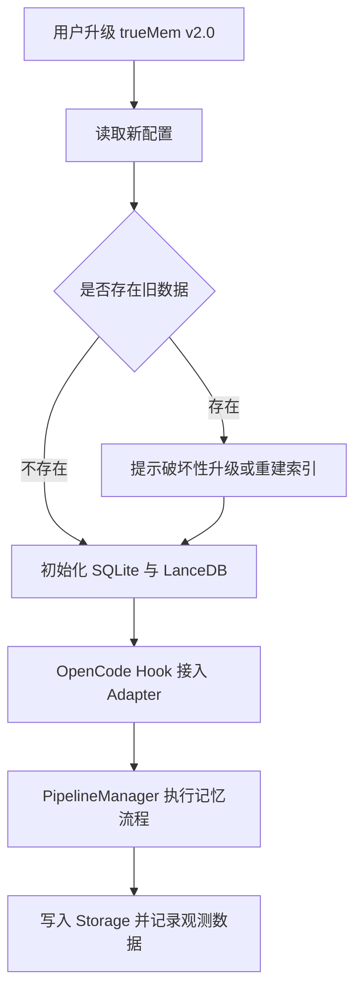
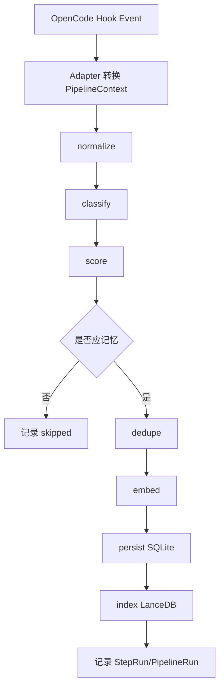
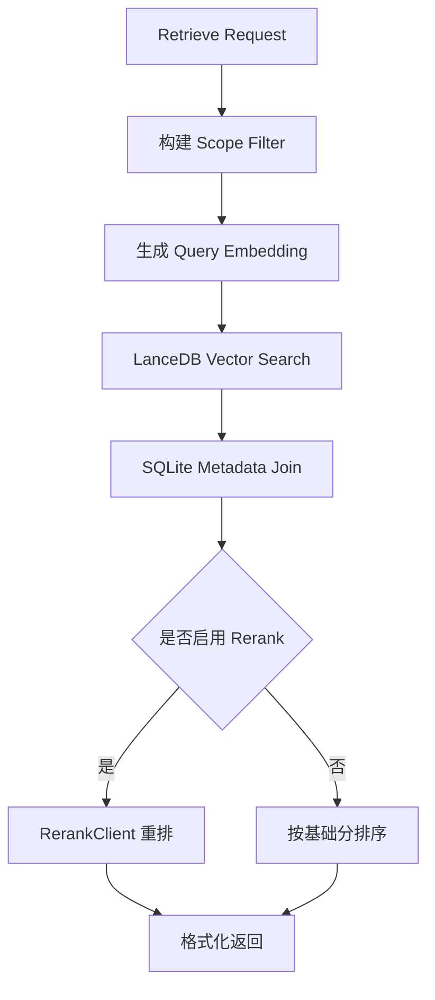
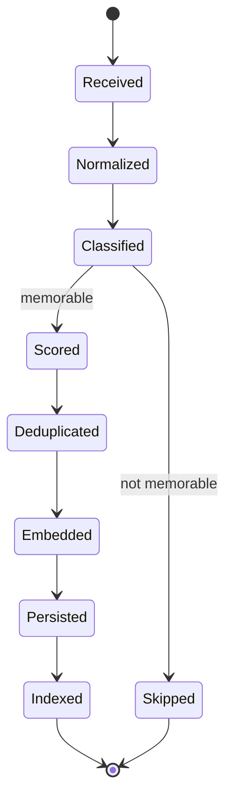

# trueMem v2.0 升级项目 PRD

## 1. 文档基础信息

| 字段 | 内容 |
|------|------|
| 文档标题 | trueMem v2.0 升级项目 PRD |
| 文档版本 | v1.0 |
| 创建日期 | 2026-04-30 |
| 项目优先级 | P1，本季度重点项目 |
| 技术栈 | TypeScript + Bun + SQLite + LanceDB |
| 项目策略 | 渐进式适配 |
| 需求状态 | 已澄清，可进入技术方案设计 |

## 2. 背景与目标

### 2.1 项目背景

trueMem 当前是面向 OpenCode 的本地记忆插件，核心优势在于认知心理学驱动的记忆判断模型：遗忘曲线、七特征评分、四层误判防御、相似度检索与本地 viewer。现有架构的问题在于基础设施层较弱：Hook 调用链路直接承载业务逻辑，SQLite 检索偏暴力搜索，embedding-worker 偏具体实现而非模型调用抽象，scope 逻辑容易散落在查询与存储代码中。

memU 的优势在于工程基础设施：Pipeline Engine、Pluggable Storage、LLM 抽象、Scope Model 传播与可组合 workflow。trueMem v2.0 的目标是吸收这些基础设施能力，但不改变 trueMem 的认知模型。

### 2.1.1 融合定位

trueMem v2.0 不是“用 TypeScript 重写 memU”。它是让 trueMem 的认知模型运行在一个受 memU 启发的基础设施 substrate 之上。

```text
trueMem v2.0 is not memU rewritten in TypeScript.
It is trueMem's cognitive model running on a memU-inspired infrastructure substrate.
```

融合关系必须遵守三条原则：

1. **认知模型主权归 trueMem**：记忆判断、遗忘衰减、七特征评分、四层误判防御仍由 trueMem 定义。
2. **基础设施能力借鉴 memU**：Pipeline、Storage、LLM、Scope 借鉴 memU 的工程思想，但以 TypeScript/Bun 原生方式重建。
3. **跨语言零耦合**：不引入 Python/Rust runtime 依赖，不直接复用 memU 类型、目录结构或运行时，只复用经过抽象后的架构概念。

### 2.2 核心目标

1. 将 trueMem 从“Hook 直接执行业务逻辑”的插件结构升级为“Hook 入口 + Pipeline 内核”的可编排架构。
2. 将存储层从单一 SQLite 实现升级为可插拔 Storage Provider，首批支持 SQLite 与 LanceDB。
3. 将 scope 从硬编码过滤逻辑升级为可扩展 tags-based Scope Context。
4. 将 embedding-worker 升级为标准化模型调用层，支持 Embedding、Chat、Rerank 三类能力。
5. 在不改变认知模型的前提下，实现旧行为等价、新能力可测、关键链路可观测。
6. 建立 memU-inspired Anti-Corruption Layer，确保 memU 的基础设施优点被吸收为 trueMem 原生抽象，而不是形成跨语言或跨项目耦合。

### 2.3 预期价值

| 价值类型 | 预期收益 |
|----------|----------|
| 工程可维护性 | 记忆流程拆分为可测试 WorkflowStep，降低核心逻辑耦合 |
| 检索扩展性 | LanceDB 支持本地向量检索，降低 SQLite 暴力搜索瓶颈 |
| 模型扩展性 | Embedding、Chat、Rerank 统一为 provider/profile/client 抽象 |
| 场景扩展性 | tags-based scope 支持 project/session/source/type 等多维记忆边界 |
| 质量保障 | 每个 pipeline step 可观测、可回归、可开关 |

### 2.4 memU 能力映射

| memU 优点 | trueMem v2.0 映射 | 融合方式 | 边界 |
|-----------|-------------------|----------|------|
| PipelineManager / WorkflowStep | `PipelineManager`、`WorkflowStep`、`PipelineContext` | 借鉴 workflow 编排、requires/produces、step tracing | 不照搬 Python 实现；Hook 仍是 OpenCode 外部入口 |
| Pipeline Interceptor | `PipelineInterceptor` / tracing hooks | 借鉴 before/after/on_error 观测模型 | 不让 interceptor 改写认知判断结果 |
| Pluggable Database | `StorageProvider`、`MemoryRepository`、`VectorRepository` | 借鉴 provider + repository 分层 | 首批只做 SQLite + LanceDB；不引入 Postgres/pgvector 作为 v2.0 目标 |
| Scope Propagation | `ScopeContext` + reserved tags | 借鉴 scope 随请求传播与记录模型持久化 | scope 是过滤与隔离语义，不改变 salience 或分类逻辑 |
| LLM Profiles | `LLMProvider`、`EmbeddingClient`、`ChatClient`、`RerankClient` | 借鉴按 step/profile 路由模型能力 | v2.0 默认不让 Chat/Rerank 参与记忆分类决策 |
| Maintenance Pipeline | `memory.maintenance` | 借鉴后台维护、索引重建、一致性检查 | 不把维护任务放入 Hook 主链路 |
| Composition Root | `createTrueMemCore()` / Adapter 层 | 借鉴集中组装依赖的思想 | 不复制 memU 的 Python mixin 结构 |

## 3. 需求概述

### 3.1 一句话描述

本次迭代将 trueMem v2.0 升级为以 Pipeline Engine 为核心、Storage/Scope/LLM 可插拔的本地记忆系统内核，同时保持现有认知模型和用户行为语义不变。

### 3.2 范围边界

| 类型 | 内容 |
|------|------|
| 本次包含 | Pipeline Engine、Pluggable Storage、Scope Model、LLM Provider 抽象 |
| 本次不改变 | 记忆分类逻辑、遗忘曲线、七特征评分、四层防御等认知模型 |
| 本次允许 | 破坏性数据升级；用户可清空或重建索引 |
| 本次不优先 | Viewer UI 重设计、云同步、多用户权限系统、团队协作后台 |

### 3.3 实施策略

采用渐进式适配：保留现有 OpenCode Hook 入口，内部逐步改为 PipelineManager 调度。旧逻辑在迁移阶段作为行为基线，所有新 step 必须通过回归测试证明行为等价。

```text
OpenCode Hook
  -> trueMem Adapter
  -> Anti-Corruption Layer
  -> PipelineManager
  -> WorkflowStep[]
  -> Storage / Scope / LLM / Classifier
```

### 3.4 Anti-Corruption Layer

为避免 trueMem 被改造成 memU 的 TypeScript 复刻版，v2.0 必须引入概念级 Anti-Corruption Layer。

| 层级 | 职责 | 禁止事项 |
|------|------|----------|
| OpenCode Adapter | 将 OpenCode Hook 事件转换为 trueMem 内部事件 | 禁止在 Hook 层直接调用 Storage/LLM 业务逻辑 |
| Anti-Corruption Layer | 将 memU-inspired 概念映射为 trueMem 原生接口 | 禁止引入 memU Python/Rust runtime 或直接复制类型结构 |
| Core Pipeline | 执行 trueMem 记忆流程 | 禁止绕过认知模型直接写入“高置信记忆” |
| Infrastructure Providers | 提供 Storage/LLM/Scope 能力 | 禁止 provider 反向决定记忆是否应该保存 |

### 3.5 Cognitive Invariants

以下认知不变量是 v2.0 的不可破坏边界。任何 Pipeline、Storage、Scope、LLM 的改动都不得改变这些语义，除非在实验模式中显式开启并单独标记。

| 不变量 | 要求 |
|--------|------|
| 记忆判断主权 | 是否记忆仍由 trueMem 认知模型决定，不由 LLM provider、Storage provider 或 Rerank provider 决定 |
| 遗忘曲线语义 | Ebbinghaus/decay 逻辑的输入输出语义保持稳定，基础设施只负责调度与持久化 |
| 七特征评分语义 | 七特征评分可重构实现，但每个特征的含义与权重解释不得被隐式改变 |
| 四层防御语义 | false positive 防御链路必须保留，不得因 Pipeline 拆分而跳过任一关键防线 |
| Salience 语义 | salience 表示记忆重要性/保留价值，不得与向量相似度、rerank 分数混为一体 |
| Scope 隔离语义 | scope/tags 只决定边界、过滤与可见性，不直接提升或降低记忆认知评分 |
| LLM 辅助边界 | Chat/Rerank 可辅助摘要、重排、解释，但默认不得参与“是否记忆”的最终决策 |
| Viewer 兼容语义 | Viewer 展示可以适配新字段，但不得重新定义记忆类型或认知状态 |

## 4. 功能需求

### 4.1 功能清单

| 序号 | 功能模块 | 优先级 | 说明 |
|------|----------|--------|------|
| 1 | Pipeline Engine | P0 | 引入 PipelineManager、WorkflowStep、Interceptor，承载记忆提取、分类、去重、写入、检索流程 |
| 2 | Pluggable Storage | P0 | 抽象 Storage Provider，首批支持 SQLite 与 LanceDB |
| 3 | Scope Model | P1 | 引入 tags-based Scope Context，支持任意 tags，同时提供最小规范字段 |
| 4 | LLM Provider 抽象 | P1 | 支持 Embedding、Chat、Rerank 三类模型能力，替代单一 embedding-worker 思路 |
| 5 | Observability & Regression | P0 | 为 pipeline step 增加耗时、错误、输入输出摘要、开关与回归测试能力 |
| 6 | Upgrade Safety & Migration | P0 | 定义破坏性升级边界、备份、回滚限制、半迁移恢复与索引重建策略 |
| 7 | Reliability & Error Policy | P0 | 定义错误分类、重试/跳过/中止策略、队列背压与失败记录 |
| 8 | Behavioral Evaluation Harness | P0 | 固化旧版行为 golden cases，证明认知模型未被基础设施重构破坏 |

### 4.2 Pipeline Engine

#### 输入

- OpenCode Hook 事件：用户消息、助手回复、会话结束、项目上下文变化。
- 现有 trueMem 记忆处理输入：文本、metadata、scope、source、timestamp。

#### 处理

1. Adapter 将 Hook 事件转换为 PipelineContext。
2. PipelineManager 根据事件类型选择 pipeline。
3. WorkflowStep 按 requires/produces 声明依赖关系。
4. Interceptor 在 before/after/on_error 节点记录观测数据。
5. 失败 step 需要返回结构化错误，不能静默吞掉。

#### 输出

- 标准化 PipelineResult。
- 写入或检索的 memory records。
- step-level tracing 数据。

#### 必需 pipeline

| Pipeline | 用途 | 典型步骤 |
|----------|------|----------|
| memory.ingest | 处理新输入并判断是否记忆 | normalize -> classify -> score -> dedupe -> embed -> persist |
| memory.retrieve | 检索相关记忆 | normalize query -> vector search -> keyword fallback -> rerank -> format |
| memory.decay | 更新遗忘曲线与 salience | load candidates -> compute decay -> update scores |
| memory.maintenance | 重建索引或清理无效记录 | scan -> validate -> reindex/archive |

#### Pipeline 版本化与门禁

| 要求 | 说明 |
|------|------|
| Pipeline version | 每个 pipeline 必须声明 `pipelineId` 与 `version`，PipelineRun 必须记录执行版本 |
| Step version | 影响输入/输出语义的 WorkflowStep 必须声明 `stepVersion` |
| 阶段门禁 | M1 只允许接管 ingest 最小链路；未通过旧行为 golden cases 前，不允许替换 retrieve 默认路径 |
| 灰度开关 | 每条新 pipeline 必须可通过配置开关启用/禁用 |
| Trace 可解释性 | 任何生产 trace 必须能反推出当时使用的 pipeline/step/provider 版本 |

### 4.3 Pluggable Storage

#### 输入

- MemoryRecord、EmbeddingVector、ScopeContext、ProviderConfig。

#### 处理

1. 定义 StorageProvider 接口。
2. SQLiteProvider 负责结构化记录、配置、日志、小规模兼容读写。
3. LanceDBProvider 负责向量索引与本地 ANN 检索。
4. Repository 层隐藏 provider 差异。
5. v2.0 允许破坏性升级，不要求旧 SQLite 数据无损迁移。

#### 输出

- 统一的 create/update/delete/search API。
- SQLite 与 LanceDB 的最小可用实现。
- 重建索引命令或脚本。

#### 首批后端

| 后端 | 定位 | 说明 |
|------|------|------|
| SQLite | 本地元数据与配置存储 | 保留 trueMem 本地插件体验 |
| LanceDB | 本地向量检索 | 替代纯 SQLite 暴力向量搜索 |

#### SQLite 与 LanceDB 一致性模型

| 场景 | 要求 |
|------|------|
| 写入顺序 | MemoryRecord 先写入 SQLite，EmbeddingRecord / vector index 后写入 LanceDB |
| LanceDB 写入失败 | SQLite 记录保留 `indexStatus=failed`，进入 maintenance pipeline 重试 |
| SQLite 写入失败 | 整体写入失败，不允许产生孤立向量 |
| 索引重建 | 必须提供从 SQLite 全量重建 LanceDB 索引的命令 |
| 一致性检查 | maintenance pipeline 必须能扫描 SQLite 与 LanceDB 的缺失、孤立、维度不匹配记录 |
| 查询降级 | LanceDB 不可用时允许降级到 SQLite metadata/keyword 检索，但必须返回 degraded 标记 |

### 4.4 Scope Model

#### 输入

- Hook 来源、项目路径、会话 ID、消息角色、用户自定义 tags。

#### 处理

1. 定义 ScopeContext：`tags: Record<string, string | string[]>`。
2. 支持任意 tags，但提供最小规范：`project`、`session`、`source`、`type`。
3. 所有 MemoryRecord 必须携带 ScopeContext。
4. 查询时 Repository 层统一接收 scope filter，禁止业务层散落手写过滤。

#### 输出

- 可扩展 scope tags。
- 统一 scope filter。
- 支持 global/project/session/source/type 的默认语义。

#### 最小规范字段

| Tag | 用途 | 示例 |
|-----|------|------|
| project | 项目边界 | `memU-main` |
| session | 会话边界 | `ses_xxx` |
| source | 来源系统 | `opencode` |
| type | 记忆类型 | `preference`、`decision`、`fact` |
| confidence | 可信度/置信等级 | `high`、`medium`、`low` |
| visibility | 可见范围 | `local`、`project`、`private` |

#### Scope tags 治理规则

| 规则 | 要求 |
|------|------|
| Reserved tags | `project`、`session`、`source`、`type`、`confidence`、`visibility` 为保留字段 |
| Normalization | tag key 必须小写，使用 kebab-case 或 snake_case，禁止空 key |
| Conflict behavior | 同一 key 出现冲突时，以更具体 scope 优先：session > project > global |
| Missing behavior | 缺失 `source` 时默认 `opencode`；缺失 `visibility` 时默认 `local` |
| 旧 scope 映射 | 旧版 global/project scope 在升级时映射为 tags，不要求旧数据无损迁移，但新写入必须统一走 ScopeContext |

### 4.5 LLM Provider 抽象

#### 输入

- 模型任务类型：embedding、chat、rerank。
- provider config、profile config、pipeline step config。

#### 处理

1. 定义统一 LLMClient 接口族。
2. EmbeddingClient 负责文本向量化。
3. ChatClient 负责摘要、解释、结构化提取等后续能力。
4. RerankClient 负责检索结果重排。
5. pipeline step 通过 profile 选择具体 provider。
6. v2.0 不允许 LLM 抽象改变现有记忆分类决策结果，除非显式开启实验配置。

#### 输出

- 标准化模型调用结果。
- provider/profile 配置结构。
- 可 mock 的测试客户端。
- embedding-worker 迁移路径。

#### Provider 能力契约

| 能力 | 契约 |
|------|------|
| Embedding | 必须声明 model、dimension、batchSize、maxInputTokens；写入 LanceDB 前校验 dimension |
| Chat | 必须声明是否支持 structured output、streaming、tool calling；v2.0 默认不参与认知分类决策 |
| Rerank | 必须声明最大候选数、score 范围、是否稳定排序；缺失时回退基础相似度排序 |
| Feature flags | 每个 provider 必须声明 `supportsEmbedding`、`supportsChat`、`supportsRerank` |
| Fallback | provider 不支持目标能力时，pipeline 必须跳过或降级，不允许隐式调用错误能力 |
| Local-first | 默认优先本地 provider；远程 provider 必须显式配置并提示可能发生数据外发 |

### 4.6 Observability & Regression

每个 WorkflowStep 必须记录：

| 字段 | 说明 |
|------|------|
| stepId | 步骤 ID |
| pipelineId | pipeline ID |
| durationMs | 执行耗时 |
| status | success / skipped / failed |
| errorCode | 结构化错误码 |
| inputSummary | 输入摘要，不记录敏感原文 |
| outputSummary | 输出摘要 |
| provider | 如涉及 storage 或 LLM，记录 provider 名称 |
| version | pipeline、step、provider 的版本信息 |

### 4.7 Behavioral Evaluation Harness

v2.0 必须交付一套旧行为等价评测集，用于证明基础设施升级没有改变 trueMem 的认知模型。

| 测试类别 | Golden case 要求 |
|----------|------------------|
| 应记忆 | 用户偏好、明确决策、长期事实、项目约束必须被识别为可记忆 |
| 不应记忆 | 临时闲聊、一次性命令、短期噪音、敏感凭证必须被拒绝或脱敏 |
| 四层防御 | 覆盖 false positive 防御链路，证明重构后仍可拦截误记忆 |
| 七特征评分 | 对代表性输入固化 score 区间，允许实现变化但不允许语义漂移 |
| 遗忘衰减 | 固化 Ebbinghaus/decay 行为样例，验证 salience 更新一致 |
| 检索排序 | 对固定 query 与 memory set 固化 Top-K 期望或排序区间 |
| Scope 过滤 | 覆盖 global/project/session/tags 的包含、排除、冲突场景 |
| 错误路径 | provider 失败、storage 失败、queue 积压时行为可预期 |

### 4.8 Upgrade Safety & Migration

v2.0 允许破坏性升级，但“破坏性”不等于无升级策略。

| 项目 | 要求 |
|------|------|
| 升级前备份 | 执行破坏性升级前必须提示用户备份旧 SQLite 文件与配置 |
| 不保证项 | 不保证旧数据无损迁移，不保证旧向量索引可复用 |
| 必须保留项 | 用户显式配置、provider profile、基础插件启用状态应尽量保留或提示重配 |
| 半迁移处理 | 若初始化 SQLite 成功但 LanceDB 失败，系统进入 degraded 状态并允许重建索引 |
| 不可逆提示 | 清空、重建、重索引等操作必须明确提示不可逆或不可完全回滚 |
| 恢复路径 | 至少提供手动恢复说明：停止插件 -> 替换备份文件 -> 重启 OpenCode/trueMem |

### 4.9 Reliability & Error Policy

| 错误类型 | 示例 | 策略 |
|----------|------|------|
| retryable | 临时 provider 超时、LanceDB 短暂锁定、网络抖动 | 指数退避重试，超过次数进入失败记录 |
| non-retryable | 配置缺失、embedding dimension 不匹配、schema 不兼容 | 立即失败，提示用户修复配置或重建索引 |
| degradable | Rerank 不可用、LanceDB 不可用但 SQLite 可用 | 降级执行并在结果中标记 degraded |
| fatal | 数据库文件损坏、迁移中断且无法恢复 | 中止 pipeline，保留诊断信息，禁止继续写入 |

#### Queue 与背压

| 项目 | 要求 |
|------|------|
| 队列上限 | 必须定义最大待处理任务数，避免 Hook 异步任务无限堆积 |
| 任务优先级 | retrieve > ingest > maintenance，避免维护任务阻塞用户检索 |
| 失败记录 | 超过重试上限的任务进入 failed jobs 记录，可由 maintenance pipeline 处理 |
| 丢弃策略 | 对低价值、可重建、过期的 maintenance 任务允许丢弃；对用户显式记忆请求不得静默丢弃 |

## 5. 交互与界面

### 5.1 用户可见变化

v2.0 默认不重设计 Viewer UI。用户侧主要变化是配置项和升级行为：

1. 可选择 SQLite + LanceDB 本地存储组合。
2. 可配置模型 provider/profile。
3. 可查看 pipeline step 的基础诊断信息。
4. 升级到 v2.0 时允许破坏性重建索引。

### 5.2 操作流程



### 5.3 系统响应

| 场景 | 系统响应 |
|------|----------|
| LanceDB 初始化失败 | 降级到 SQLite 元数据可用状态，并提示向量检索不可用 |
| LLM provider 不可用 | 返回结构化错误，pipeline step 标记 failed，不静默失败 |
| Hook 事件处理超时 | 主链路不阻塞，异步队列继续处理 |
| scope tags 缺失 | 自动补齐 source/type，project/session 可为空 |

## 6. 数据需求

### 6.1 核心实体

| 实体 | 字段 | 说明 |
|------|------|------|
| MemoryRecord | id、content、summary、type、score、createdAt、updatedAt、scopeTags、metadata | 核心记忆记录 |
| EmbeddingRecord | id、memoryId、vector、model、dimension、createdAt | 向量记录，LanceDB 管理 |
| PipelineRun | id、pipelineId、status、startedAt、endedAt、durationMs | pipeline 执行记录 |
| StepRun | id、pipelineRunId、stepId、status、durationMs、errorCode | step 观测记录 |
| ProviderConfig | provider、profile、type、options | LLM/Storage provider 配置 |

### 6.2 接口定义

| 接口 | 输入 | 输出 |
|------|------|------|
| `PipelineManager.run()` | pipelineId、PipelineContext | PipelineResult |
| `StorageProvider.createMemory()` | MemoryRecordInput | MemoryRecord |
| `StorageProvider.search()` | query、scope、limit | MemorySearchResult[] |
| `EmbeddingClient.embed()` | text、profile | EmbeddingResult |
| `ChatClient.complete()` | messages、profile | ChatResult |
| `RerankClient.rerank()` | query、candidates、profile | RerankResult[] |

### 6.3 数据处理逻辑

| 操作 | 规则 |
|------|------|
| 创建 | ingest pipeline 判断需要记忆后创建 MemoryRecord 与 EmbeddingRecord |
| 更新 | decay pipeline 或 dedupe step 更新 salience/score/metadata |
| 删除 | v2.0 支持按 id 删除；批量清理放入 maintenance pipeline |
| 重建 | 允许破坏性重建 LanceDB 向量索引 |

## 7. 非功能性需求

### 7.1 性能需求

| 指标 | 目标 |
|------|------|
| Hook 主链路 | 不明显阻塞 OpenCode 交互；耗时操作异步化 |
| 本地检索 | 中小规模本地数据下保持秒级以内 |
| 写入流程 | embedding 与持久化可异步执行 |
| Pipeline 观测 | 观测记录不得显著放大主流程延迟 |

### 7.2 兼容性需求

| 项目 | 要求 |
|------|------|
| 数据兼容 | 允许破坏性升级；不强制旧数据无损迁移 |
| 行为兼容 | 认知模型判断结果应与旧版等价，除非显式开启实验能力 |
| OpenCode Hook | 外部入口保持兼容，内部实现可替换 |
| Viewer | v2.0 不重设计 UI，但应尽量维持可用 |

### 7.3 安全与隐私

1. 观测日志不得默认记录完整敏感原文。
2. LLM provider 配置不得在日志中泄露 token。
3. 本地数据默认保留在用户机器上。
4. 远程 provider 调用必须显式配置。
5. Chat/Rerank 如调用远程 provider，必须在配置层显式标注 data egress。
6. local-only mode 下禁止任何记忆原文、摘要、embedding 请求离开本机。
7. trace、error、failed jobs 中的内容字段必须默认脱敏或摘要化。

### 7.4 扩展性

1. 新增 StorageProvider 不应修改业务 pipeline。
2. 新增 LLM provider 不应修改 WorkflowStep。
3. 新增 scope tag 不应修改数据表核心结构。
4. 第三方 step/interceptor 可作为 v2.1 后续能力预留。

### 7.5 本地插件约束

| 约束 | 要求 |
|------|------|
| 文件访问 | provider/storage 插件只应访问 trueMem 配置的数据目录 |
| 网络访问 | 默认禁止隐式网络调用；远程 provider 必须显式配置 |
| 版本兼容 | 插件或 provider 必须声明兼容的 trueMem core version |
| 失败隔离 | provider 失败不得导致 OpenCode 主进程崩溃 |
| 配置隔离 | token、endpoint、模型名等 provider 配置不得写入普通 trace |

## 8. 流程与逻辑

### 8.1 记忆写入流程



### 8.2 记忆检索流程



### 8.3 状态流转



## 9. 验收标准

### 9.1 功能验收

- [ ] OpenCode Hook 仍可触发记忆写入与检索流程。
- [ ] PipelineManager 可执行 ingest、retrieve、decay、maintenance 至少四类 pipeline。
- [ ] WorkflowStep 支持 requires/produces 或等价依赖声明。
- [ ] Interceptor 支持 before、after、on_error 或等价扩展点。
- [ ] SQLiteProvider 可存储元数据与配置。
- [ ] LanceDBProvider 可写入向量并完成本地向量检索。
- [ ] ScopeContext 支持任意 tags，并内置 project/session/source/type 规范字段。
- [ ] EmbeddingClient、ChatClient、RerankClient 接口存在并可通过 mock 测试。
- [ ] 默认配置下不改变现有认知模型判断结果。

### 9.2 性能验收

- [ ] Hook 主链路不被 embedding、rerank、索引重建等耗时任务明显阻塞。
- [ ] 中小规模本地数据下，检索体验保持秒级以内。
- [ ] Pipeline 观测记录开启后，不导致主流程不可接受的延迟放大。

### 9.3 回归验收

- [ ] 旧版核心记忆场景在 v2.0 默认配置下结果等价。
- [ ] 每个核心 WorkflowStep 有单元测试。
- [ ] StorageProvider 至少覆盖 SQLite 与 LanceDB 的 CRUD/search 测试。
- [ ] LLM provider 使用 mock client 完成 embedding/chat/rerank 测试。
- [ ] 破坏性升级路径有明确提示或命令。
- [ ] Golden cases 覆盖应记忆、不应记忆、误判防御、七特征评分、遗忘衰减、检索排序、Scope 过滤和错误路径。
- [ ] PipelineRun 可记录 pipeline/step/provider 版本，历史 trace 可解释。
- [ ] SQLite 与 LanceDB 一致性检查可发现并修复缺失索引、孤立向量、dimension 不匹配。
- [ ] Queue/backpressure 行为可测试：超时、积压、失败重试、失败记录均有确定结果。

### 9.4 升级安全验收

- [ ] 破坏性升级前有明确备份提示。
- [ ] LanceDB 初始化失败时系统进入 degraded 状态，而不是静默失败或崩溃。
- [ ] 提供从 SQLite 重建 LanceDB 索引的命令或维护流程。
- [ ] local-only mode 下远程 Embedding/Chat/Rerank 不会被调用。
- [ ] 不可逆操作有明确用户提示。

### 9.5 不验收项

- [ ] 不以旧数据无损迁移作为 v2.0 必须验收项。
- [ ] 不以 Viewer UI 重设计作为 v2.0 验收项。
- [ ] 不以云同步、多用户权限、团队协作为 v2.0 验收项。

## 10. 项目计划

### 10.1 四阶段里程碑

| 阶段 | 目标 | 交付物 | 验收重点 |
|------|------|--------|----------|
| M1 | Pipeline 骨架 | PipelineManager、WorkflowStep、Interceptor、基础 ingest pipeline | Hook 可接入，step 可测可观测 |
| M2 | Storage + LanceDB | StorageProvider、SQLiteProvider、LanceDBProvider、重建索引命令、一致性检查 | 元数据与向量检索可用，半失败可恢复 |
| M3 | Scope tags | ScopeContext、scope filter、reserved tags、旧 scope 映射规则 | 查询与写入统一携带 scope，冲突行为确定 |
| M4 | LLM 抽象 + 回归 | Embedding/Chat/Rerank Client、mock 测试、回归测试集、local-only mode | 旧行为等价，新能力可测，远程调用边界清晰 |

### 10.1.1 阶段依赖门禁

| 门禁 | 规则 |
|------|------|
| M1 -> M2 | ingest pipeline 通过最小 golden cases，且 Hook 外部入口不破坏 |
| M2 -> M3 | SQLite/LanceDB 双写、降级、一致性检查通过测试 |
| M3 -> M4 | ScopeContext 在写入与检索路径全链路传播，reserved tags 冲突规则通过测试 |
| M4 -> 发布 | 旧行为等价测试、升级安全测试、local-only 隐私测试全部通过 |

### 10.2 负责人矩阵

| 角色 | 负责人 |
|------|--------|
| 产品负责人 | 待定 |
| 技术负责人 | 待定 |
| 开发负责人 | 待定 |
| 测试负责人 | 待定 |

### 10.3 风险与应对

| 风险 | 等级 | 应对 |
|------|------|------|
| 四项能力同时纳入导致范围膨胀 | 高 | 坚持四阶段渐进，M1-M4 顺序验收 |
| tags 过度自由导致 scope 混乱 | 中 | 保留任意 tags，但强制最小规范字段 |
| LLM 抽象改变认知判断 | 高 | 默认不让 chat/rerank 影响记忆分类决策 |
| LanceDB 引入新依赖复杂度 | 中 | SQLite 继续承担元数据主存储，LanceDB 聚焦向量索引 |
| 破坏性升级影响用户历史数据 | 中 | 提供明确升级提示与重建索引命令 |
| SQLite 与 LanceDB 数据不一致 | 高 | 明确写入顺序、失败状态、maintenance 修复与全量重建 |
| 异步队列堆积造成隐性失败 | 高 | 定义队列上限、重试策略、失败记录与背压规则 |
| 远程 LLM provider 造成隐私外发 | 高 | 默认 local-first，local-only 禁止远程调用，配置显式提示 data egress |
| Pipeline 版本变化导致 trace 不可解释 | 中 | PipelineRun 记录 pipeline/step/provider version |

## 11. 后续建议

1. PRD 通过后，生成 SDD 技术设计文档，重点展开 TypeScript 接口、目录结构、迁移计划和测试矩阵。
2. 在 SDD 中明确 PipelineContext、WorkflowStep、StorageProvider、LLMClient 的 TypeScript 类型定义。
3. 在实施前建立旧行为回归样例集，防止基础设施升级改变 trueMem 的认知模型。
4. 在实施前定义 destructive upgrade runbook，包含备份、重建、失败恢复和不可逆操作提示。
5. 在实施前定义 local-only 与 remote-provider 两套隐私配置样例。
