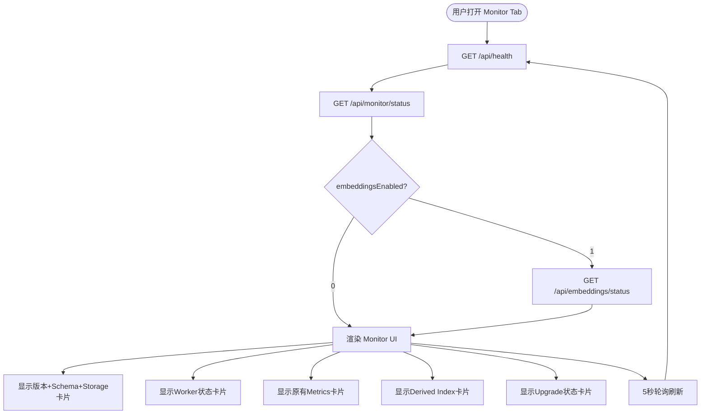
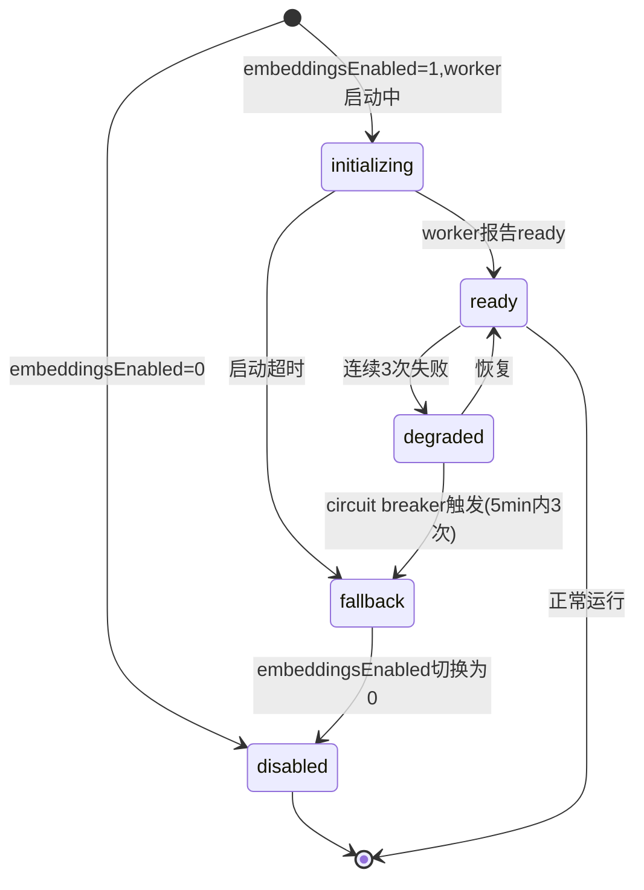
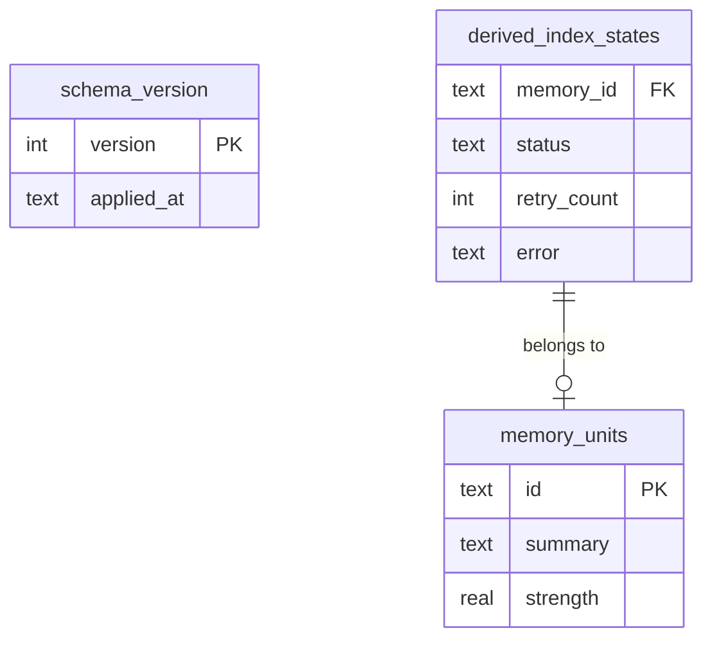
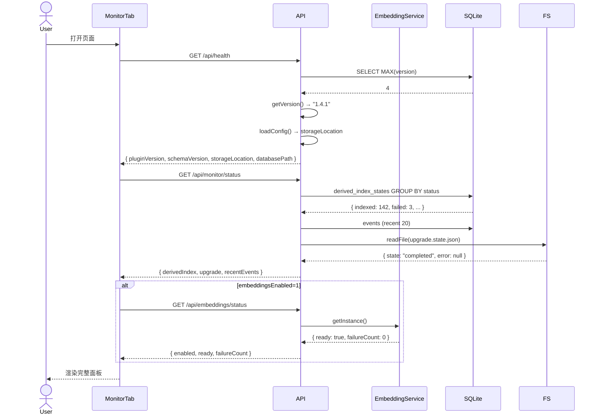

# 详细设计文档 — Viewer Monitor 升级

> 主责：前端开发，配合：后端开发

| **版本** | **修订日期**   | **修订人** | **修订内容** |
| ------ | ---------- | ------- | -------- |
| 1.0    | 2026-05-02 | Sisyphus | 初稿 |
| 1.1    | 2026-05-02 | Sisyphus | 追加 Tier 2：Upgrade 状态 + Storage 位置 |

---

# 1、背景

## 1.1 项目背景

trueMem v1.4.1 后端能力已完成多项升级（Schema v4、Upgrade 状态机、Config 迁移 v1.2→v1.3、Storage 数据迁移、Embeddings worker 管理），但 Viewer（本地 Web 管理控制台，`http://127.0.0.1:3456`）未同步暴露这些能力。

当前 Viewer 的 Monitor Tab 仅展示从 `events` 表推断的 activity/error rate、active sessions、memory health 和 recent events，面对以下场景完全失明：

- 用户不知道插件当前运行在哪个版本
- 数据库 schema 是否升级到最新不可知
- Embeddings 功能开启了但 worker 是否正常工作无法确认（静默降级到 Jaccard）
- 切换 storage location 时数据迁移是否成功不可见
- Upgrade 状态机运行到哪一步没有反馈

这不是"缺几个好看图表"的审美问题——这是 Viewer 作为系统自我认知层的结构性缺失。

## 1.2 项目目标

在 Viewer Monitor Tab 中新增 6 个信息维度，同时在 /api/health 和 /api/monitor/status 端点做配套增强，使 Viewer 成为 trueMem 系统的完整自检面板：

1. **版本可见**：Monitor 页显示插件版本号 + DB schema 版本
2. **Worker 可见**：Embeddings 开关背后 worker 的实际运行状态
3. **存储状态可见**：schema_version 历史、derived index 概况
4. **Upgrade 可见**：升级状态机当前状态（ready/migrating/completed/failed）
5. **Storage 位置可见**：当前的 storageLocation 配置值与实际 databasePath 对照
6. **向后兼容**：不破坏现有 Viewer 的任何功能

## 1.3 技术方案核心

- **改动范围**：Viewer server（3 个文件）+ Viewer UI（3 个文件）+ Shared types（1 个文件）
- **新增 API**：`GET /api/embeddings/status`
- **增强 API**：`GET /api/health`、`GET /api/monitor/status`
- **技术栈**：Hono（后端）、Preact + TypeScript + Chart.js（前端）、SQLite + 文件系统（数据源）
- **设计原则**：
  - 新指标优先通过 SQL 直接从 `memory.db` 查询；Upgrade 状态读 `upgrade.state.json` 文件
  - Embeddings status 通过 `EmbeddingService.getInstance()` 运行时获取（singleton 模式）
  - 版本号通过 `getVersion()` 从 `package.json` 运行时读取
  - Storage 位置通过 `loadConfig()` 获取 `storageLocation` 字段

## 1.4 原型与 PRD

- PRD：无正式 PRD，需求由代码审计 + gap 分析得出
- 分析依据：`src/index.ts`、`src/upgrade/`、`src/memory/embeddings-nlp.ts`、`src/storage/database.ts`、`src/viewer/` 全部源码
- 参考文档：项目 `AGENTS.md`

---

# 2、业务流程

## 2.1 Monitor 页面加载流程



## 2.2 Embeddings Worker 状态流转



---

# 3、数据库设计

## 3.1、领域模型

本次升级涉及的现有数据实体：

- **schema_version**：DB schema 迁移历史，字段 `version (INT)`, `applied_at (TEXT)`
- **derived_index_states**：每个 memory 的向量索引状态，字段 `memory_id`, `status`, `retry_count`, `error`, `degraded_reason`
- **memory_units**：记忆主表（已有，无变更）
- **events**：事件流表（已有，无变更）

新增领域对象：

- **EmbeddingWorkerStatus**：运行时状态对象，非持久化。字段 `enabled`, `ready`, `failureCount`, `circuitBreakerActive`

## 3.2、ER 图逻辑关系



## 3.3、表设计

**无新增表**——所有新增查询基于已有表。Upgrade 状态通过 `upgrade.state.json`（文件系统）获取。

### 3.3.1 schema_version（已有，只读查询）

```sql
-- 查询当前 schema 版本
SELECT MAX(version) AS current_version FROM schema_version;

-- 查询所有迁移记录
SELECT version, applied_at FROM schema_version ORDER BY version;
```

### 3.3.2 derived_index_states（已有，只读查询）

```sql
-- 查询索引状态分布
SELECT status, COUNT(*) AS count
FROM derived_index_states
GROUP BY status;
```

---

# 4、技术要点

## 4.1、核心业务内容

### 4.1.1 Health 端点增强

**改动文件**：`src/viewer/server/index.ts`

**当前返回**：
```json
{ "ok": true, "databasePath": "...", "databaseExists": true, "generatedAt": "..." }
```

**增强后返回**：
```json
{
  "ok": true,
  "databasePath": "...",
  "databaseExists": true,
  "pluginVersion": "1.4.1",
  "schemaVersion": 4,
  "generatedAt": "..."
}
```

**实现方案**：

1. `pluginVersion`：调用 `getVersion()` → 从 `package.json` 运行时读取
2. `schemaVersion`：查询 `SELECT MAX(version) FROM schema_version`
3. 新增字段均在 Health handler 内部查询，不新增独立路由

### 4.1.2 Embeddings Status 端点（新增）

**新增文件**：`src/viewer/server/routes/embeddings.ts`

**端点**：`GET /api/embeddings/status`

**返回结构**：
```typescript
interface EmbeddingStatus {
  enabled: boolean;
  ready: boolean;
  failureCount: number;
  circuitBreakerActive: boolean;
  generatedAt: string;
}
```

**实现方案**：

1. 通过 `EmbeddingService.getInstance()` 获取 singleton 实例
2. 读取 `enabled`、`ready`、`failureCount` 属性
3. circuit breaker 判定逻辑：`failureCount >= 3` 且 `lastFailure` 在最近 5 分钟内
4. `src/viewer/server/index.ts` 注册路由：`app.route('/api/embeddings', embeddingsRoute);`

**安全注意**：Embedding Service 可能在 worker 未完成初始化时就被查询。端点返回 `ready: false` 而非抛异常，前端据此显示"初始化中"状态。

### 4.1.3 Monitor Status 端点增强

**改动文件**：`src/viewer/server/routes/monitor.ts`

**当前返回**：
```json
{
  "activityRatePerHour": 12,
  "errorRatePerHour": 0,
  "activeSessions": 3,
  "memoryHealth": { "activeRatio": 0.85, "averageStrength": 0.72, "staleCount": 5 },
  "recentEvents": [...],
  "generatedAt": "..."
}
```

**增强后返回**（在现有结构上新增 `derivedIndex` 字段）：
```json
{
  "...existing fields...": "...",
  "derivedIndex": {
    "total": 150,
    "indexed": 142,
    "failed": 3,
    "stale": 5
  }
}
```

**实现方案**：

1. 在 `withViewerDb` 回调中新增一条 SQL：
   ```sql
   SELECT status, COUNT(*) AS count
   FROM derived_index_states
   GROUP BY status
   ```
2. 汇总为 `total`、`indexed`、`failed`、`stale` 四个计数
3. 如果 `derived_index_states` 表不存在（旧 schema），返回全 0
4. MonitorStatus shared type 新增 `DerivedIndexSummary` 接口

### 4.1.4 Monitor Tab UI 改造

**改动文件**：`src/viewer/ui/components/tabs/MonitorTab.tsx`

**当前布局**：4 个 MetricCard（activity/errors/sessions/activeRatio） + 最近事件列表

**改造后布局**：

```
┌─────────────────────────────────────────────────────────────┐
│ 系统版本                        │ Embeddings Worker          │
│ ├ True-Mem v1.4.1              │ ├ 状态: 运行中 / 未启用     │
│ ├ DB Schema v4                 │ ├ 就绪: ✓ / ✗              │
│ ├ Storage: ~/.true-mem/        │ └ 故障次数: 0 / 3(熔断)    │
│ └ DB: ~/.true-mem/memory.db    │                            │
├─────────────────────────────────────────────────────────────┤
│ Upgrade 状态                                                │
│ ├ 状态: completed / failed / 未执行                         │
│ └ 最后更新: 2026-05-01 14:30                                │
├─────────────────────────────────────────────────────────────┤
│ 指标 (4 MetricCard — 不变)                                  │
│ ┌──────┐ ┌──────┐ ┌──────┐ ┌──────┐                        │
│ │ 12/h │ │ 0/h  │ │ 3    │ │ 85%  │                        │
│ └──────┘ └──────┘ └──────┘ └──────┘                        │
├─────────────────────────────────────────────────────────────┤
│ Derived Index 状态                                          │
│ ┌─────────────────────────────────────────────────────────┐ │
│ │ 总计 150  已索引 142  失败 3  过时 5                     │ │
│ └─────────────────────────────────────────────────────────┘ │
│ 最近事件 (不变)                                              │
└─────────────────────────────────────────────────────────────┘
```

**数据获取**：

```typescript
// MonitorTab 新增数据源
const [health, setHealth] = useState(null);        // GET /api/health
const [embedStatus, setEmbedStatus] = useState(null); // GET /api/embeddings/status
const [monitor, setMonitor] = useState(null);       // GET /api/monitor/status (已增强)
```

**条件渲染**：

- Embeddings Worker 卡片仅在 `embeddingsEnabled=1` 时渲染，避免空信息卡片
- Derived Index 卡片仅在 `derivedIndex.total > 0` 时渲染
- Upgrade 卡片仅在 `upgrade.state !== null` 时渲染

### 4.1.5 Monitor Status 端点增强 — Upgrade 状态

**改动文件**：`src/viewer/server/routes/monitor.ts`

**新增字段**：`upgrade`

```typescript
interface MonitorStatus {
  // ...existing fields...
  upgrade: {
    state: 'ready' | 'backing_up' | 'migrating' | 'rebuilding' | 'verifying' | 'completed' | 'failed' | null;
    error?: string;
    updatedAt: string;
  };
}
```

**实现方案**：

1. Upgrade 状态不存储在 DB 中——它持久化在 `~/.true-mem/upgrade.state.json`
2. Viewer API 读取该 JSON 文件：`fs.readFile` → `JSON.parse` → 返回 `UpgradeStatus`
3. 文件不存在时返回 `state: null`（表示从未执行过升级）
4. `failed` 状态时携带 `error` 字段供 UI 展示

**注意**：Upgrade 是一个短时过程（通常 < 10 秒），轮询间隔 5 秒足以捕获状态变化。`completed` 是终态。

### 4.1.6 Health 端点增强 — Storage 位置

**改动文件**：`src/viewer/server/index.ts`

**新增字段**：`storageLocation`

**增强后返回**：
```json
{
  "ok": true,
  "databasePath": "~/.true-mem/memory.db",
  "databaseExists": true,
  "pluginVersion": "1.4.1",
  "schemaVersion": 4,
  "storageLocation": "legacy",
  "generatedAt": "..."
}
```

**实现方案**：

1. 通过 `loadConfig()` 读取 `storageLocation`：`"legacy"`（~/.true-mem/）或 `"opencode"`（~/.config/opencode/true-mem/）
2. 与已有的 `databasePath` 并列展示，用户可直观对比
3. 如果 `databasePath` 不在 `storageLocation` 对应的预期路径下，说明迁移未完成——UI 可据此显示"迁移中"提示

## 4.2、系统架构图

```mermaid
flowchart LR
    subgraph Viewer_UI[Viewer UI (Preact)]
        MT[MonitorTab]
    end
    subgraph Viewer_Server[Viewer Server (Hono)]
        Health["GET /api/health"]
        Monitor["GET /api/monitor/status"]
        EmbeddingAPI["GET /api/embeddings/status"]
    end
    subgraph Backend[trueMem Core]
        GV[getVersion]
        ES[EmbeddingService Singleton]
        DB[(memory.db SQLite)]
    end
    subgraph FS[File System]
        US[upgrade.state.json]
        PKG[package.json]
    end

    MT -->|5s poll| Health
    MT -->|5s poll| Monitor
    MT -->|5s poll| EmbeddingAPI
    Health -->|"SELECT MAX(version)"| DB
    Health -->|"getVersion()"| GV
    Health -->|"loadConfig()"| GV
    Monitor -->|"SELECT * FROM derived_index_states"| DB
    Monitor -->|"SELECT * FROM events"| DB
    Monitor -->|"readFile"| US
    EmbeddingAPI -->|"getInstance()"| ES
```

## 4.3、相关 UML 图

### 4.3.1 Monitor Tab 首次加载序列图



---

# 5、非功能设计

## 5.1、拓展性设计

### 5.1.1、存储容量

无新增存储。所有查询基于已有 SQLite 表，数据量级：
- `schema_version`：< 10 行
- `derived_index_states`：与 `memory_units` 1:1，通常 < 1000 行
- 查询开销：每条 SQL 扫描量极小（< 1000 行），5 秒轮询间隔对性能无影响

### 5.1.2、设计模式

- **Singleton**：`EmbeddingService.getInstance()` — Monitor 通过 API 获取状态，不直接访问 singleton
- **Adapter**：`ViewerDatabase` 封装 SQLite 访问，新增查询通过该类执行
- **Polling with interval**：前端 5 秒轮询模式（现有模式，不改动）

## 5.2、兼容性设计

- **API 向后兼容**：所有现有 API 仅新增字段，不删除、不重命名
- **SQLite schema 兼容**：`derived_index_states` 查询需检查表是否存在（`SELECT name FROM sqlite_master`），schema_version < 4 时返回全 0 而非报错
- **Embeddings API 兼容**：`embeddingsEnabled=0` 时 EmbeddingService 未初始化，API 返回 `{ enabled: false, ready: false }` 而非抛异常
- **UI 兼容**：新卡片为条件渲染（embeddingsEnabled=0 时不显示 Worker 卡片；derivedIndex.total=0 时不显示 Index 卡片）

## 5.3、一致性设计

- 无缓存层，每次查询直读 SQLite，保证数据实时性
- `generatedAt` 时间戳标记每次查询快照，前端可据此判断数据新鲜度

## 5.4、并发设计

- SQLite 单写多读，Viewer 仅执行 SELECT 操作，与 trueMem 主进程的写入操作不冲突
- `EmbeddingService` singleton 的 `enabled`/`ready`/`failureCount` 在 Node 单线程环境下无并发问题

## 5.5、幂等性设计

- `GET /api/health`、`GET /api/monitor/status`、`GET /api/embeddings/status` 均为幂等只读端点
- 无副作用，可安全重试

## 5.6、高性能设计

- 所有查询为单表聚合查询，无 JOIN、无子查询，执行时间 < 1ms
- Health 端点新增两个字段仅增加 2 次调用：`getVersion()`（文件读取，< 1ms）+ `SELECT MAX(version)`（< 0.5ms）
- Monitor 端点新增 derived_index 查询：单表 GROUP BY，< 1ms

## 5.7、缓存设计

**无 Redis 缓存**。原因：
- Viewer 是本机 localhost 管理面板，无需分布式缓存
- 数据量极小（< 1000 行），每次直读 SQLite 成本可忽略
- 避免引入缓存一致性维护负担

## 5.8、数据影响范围

- **无数据变更**：所有读取为 SELECT，不 INSERT/UPDATE/DELETE
- **无下游影响**：Viewer Server 是独立进程，与其他 trueMem 组件无数据依赖
- **无历史数据影响**：新增字段属于只读查询，不影响现有数据结构

## 5.9、异常设计

| **异常类型** | **处理策略** | **重试机制** | **告警方式** |
| -------------- | --------------- | --------------- | --------- |
| `derived_index_states` 表不存在 | 返回 `derivedIndex: { total: 0, ... }`，不报错 | 无（表不存在说明 schema < v4，正常降级） | 无 |
| `EmbeddingService` 未初始化 | 返回 `{ enabled: false, ready: false }` | 无（embeddingsEnabled=0 的正常状态） | 无 |
| Embedding worker 超时未响应 | 返回 `ready: false`，UI 显示"初始化中" | 前端 5s 自动轮询刷新 | 无 |
| `getVersion()` 失败 | 返回 `pluginVersion: "unknown"` | 无 | 日志 `[True-Mem] Version detection error` |
| `schema_version` 查询失败 | 返回 `schemaVersion: null`，UI 显示"-" | 无 | 日志 |
| `upgrade.state.json` 不存在 | 返回 `upgrade.state: null`，UI 不显示该卡片 | 无（从未执行过升级的正常状态） | 无 |
| `upgrade.state.json` 损坏 | 返回 `upgrade.state: null`，UI 不显示 | 无 | 日志 |
| Viewer DB 不可用 | HTTP 503（已有逻辑，不新增） | 前端轮询自动恢复 | 日志 |

---

# 6、系统资源评估

## 6.1、资源评估

### 6.1.1、流量评估

- 前端轮询频率：`/api/health` + `/api/monitor/status` + `/api/embeddings/status`（可选）= 每 5 秒 2-3 次
- QPS：< 1
- 无外部流量，仅 localhost

### 6.1.2、内存评估

- Embedding Status 端点：读取 singleton 属性，零额外内存
- Health 端点：`getVersion()` 读取 `package.json`（~2KB），string 常量
- 前端新增状态：`health` + `embedStatus` + `derivedIndex` + `upgradeState` extra fields，< 8KB
- Upgrade 状态读取：`upgrade.state.json` 文件 < 1KB
- **总增量**：< 10KB

### 6.1.3、存储容量补充评估

- 无新增存储

---

# 7、人力计划排期

**项目阶段**：共 1 周（~1.5 人/天）

| **任务** | **负责人** | **产出物** | **工时** |
| ------ | ------- | ------- | ------ |
| 1. Shared types 扩展 | FE/BE | `src/viewer/shared/types.ts` | 0.5h |
| 2. /api/health 增强（+storageLocation） | BE | `src/viewer/server/index.ts` | 0.5h |
| 3. /api/embeddings/status 新增 | BE | `src/viewer/server/routes/embeddings.ts` + index.ts 注册 | 1h |
| 4. /api/monitor/status 增强（+derivedIndex +upgrade） | BE | `src/viewer/server/routes/monitor.ts` | 1h |
| 5. MonitorTab UI 改造 | FE | `src/viewer/ui/components/tabs/MonitorTab.tsx` | 2.5h |
| 6. i18n 补充 | FE | `src/viewer/ui/i18n/zh-CN.ts` | 0.5h |
| 7. 构建验证 | FE/BE | `bun run build` + Viewer 手动测试 | 1h |
| **合计** | | | **7h (~1 人/天)** |

**关键路径**：1 → 2/3/4（并行）→ 5 → 6 → 7

---

# 8、文档资料

## 8.1、参考资料

1. 项目 `AGENTS.md` — 技术栈、架构概览
2. `src/viewer/README.md` — Viewer 功能说明
3. `src/upgrade/state-machine.ts` — Upgrade 状态机定义
4. `src/memory/embeddings-nlp.ts` — EmbeddingService API
5. `src/utils/version.ts` — `getVersion()` 实现
6. `src/storage/database.ts` — Schema migration (v1-v4)
7. `src/upgrade/file-lock.ts` — `upgrade.state.json` 读写
8. `src/config/config.ts` — `loadConfig()` 与 `storageLocation`

---

**技术方案审批**：

| **角色** | **签字** | **日期** |
| -------- | ------ | ------ |
| 架构负责人 |        |        |
| 前端负责人 |        |        |
