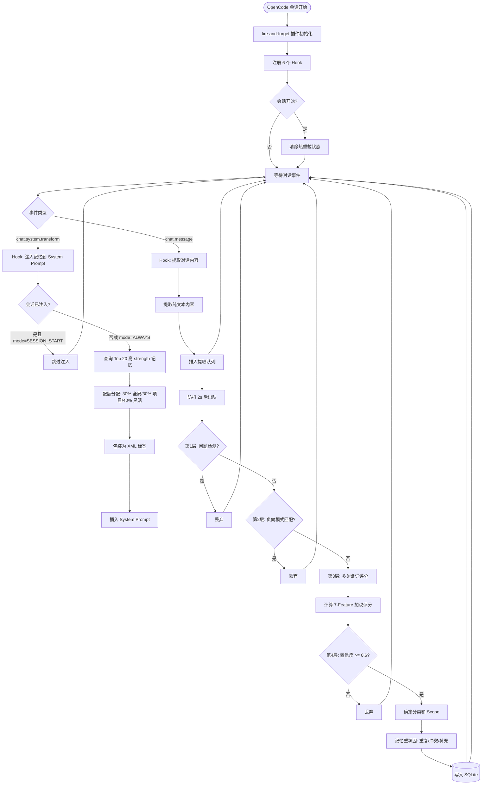
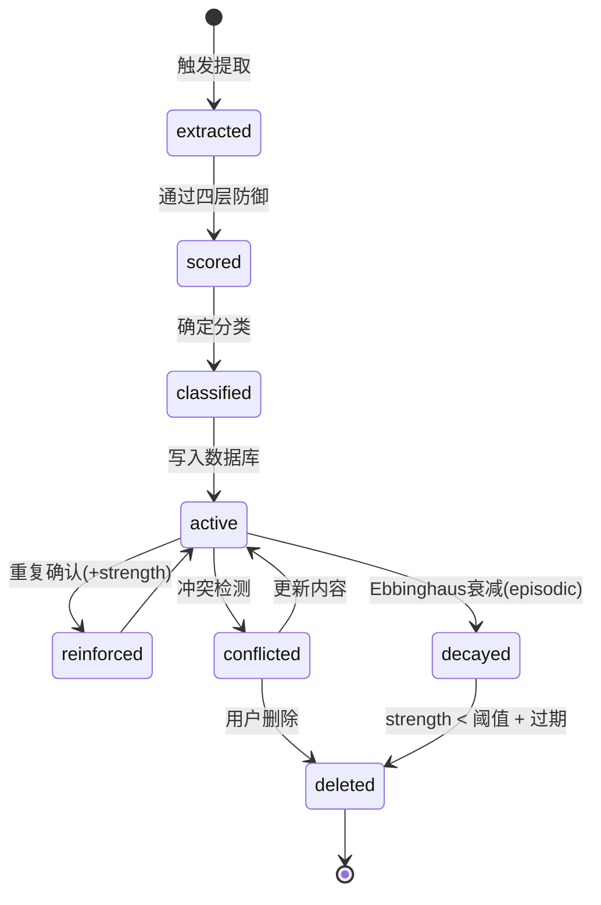
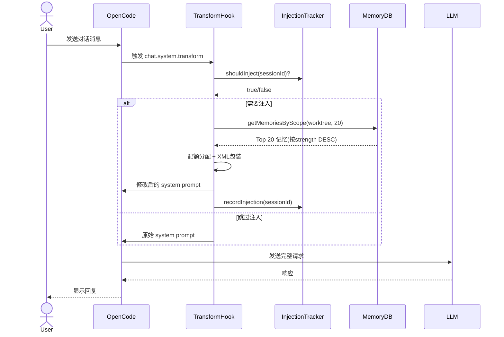
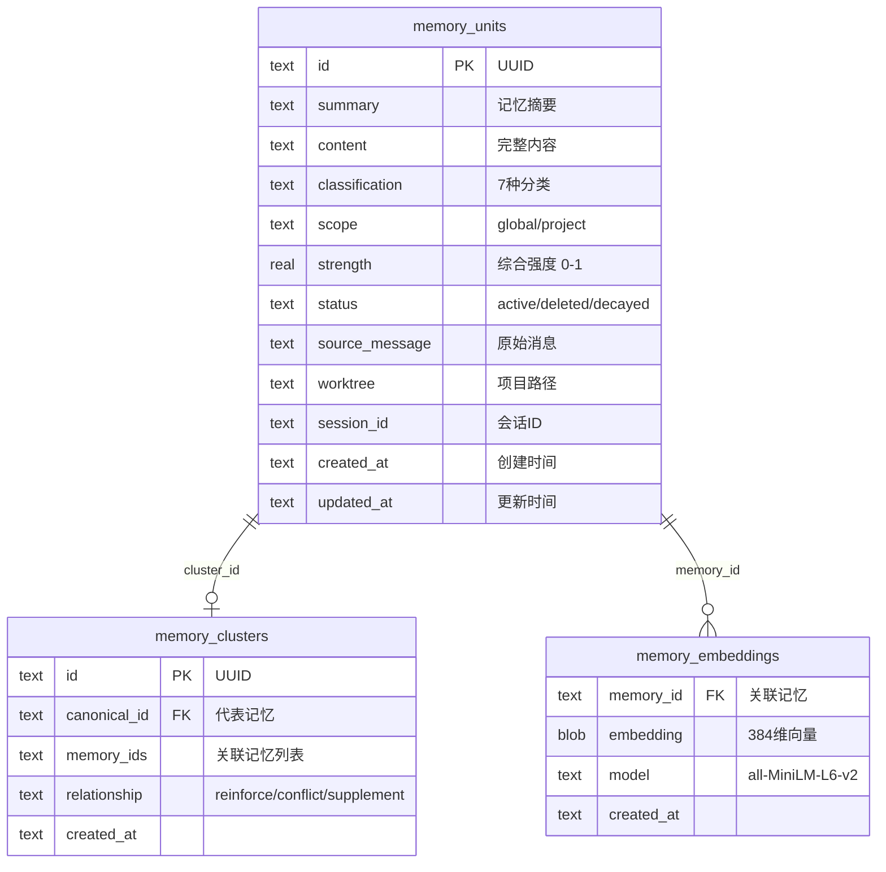
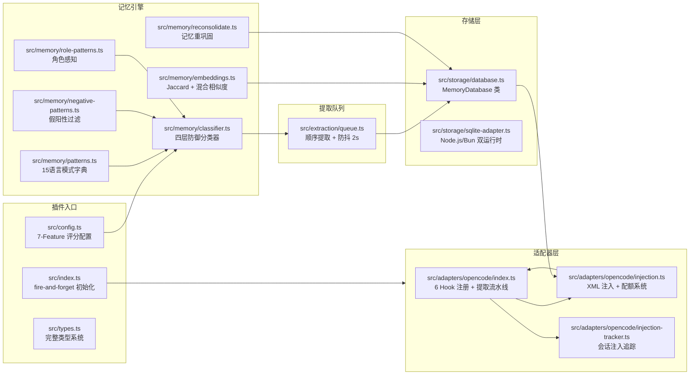
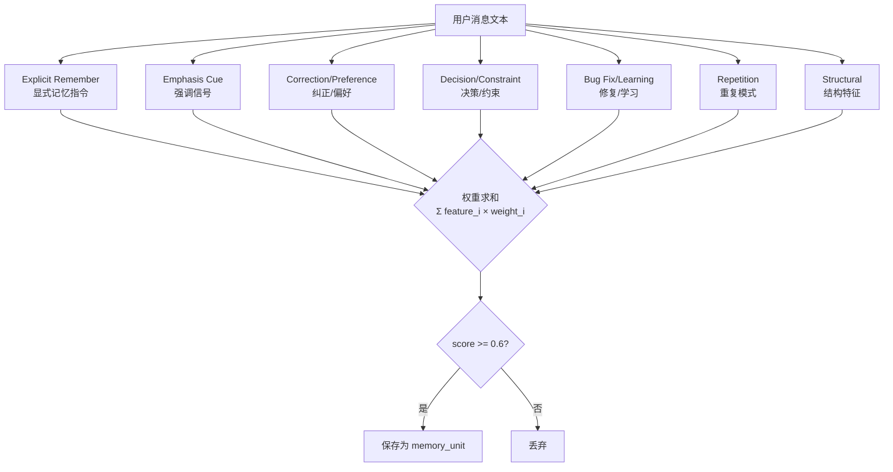

# True-Mem 详细设计文档

> **版本**: v1.0 | **日期**: 2026-04-29 | **项目版本**: v1.4.1
> **仓库**: https://github.com/rizal72/true-mem

---

## 1 项目概述

### 1.1 项目背景

True-Mem 是 OpenCode AI 编码助手的持久记忆插件，受 [PsychMem](https://github.com/muratg98/psychmem) 启发并做了显著改进。它模仿人类认知心理学中的记忆机制，自动识别对话中的重要信息（偏好、决策、约束、学习等）并持久化存储，在后续会话中按需注入上下文。

**核心痛点**：AI 助手在每次会话中丢失之前建立的上下文，用户需反复重新说明偏好、决策、约束。

**解决思路**：通过多语言模式匹配 + 四层防御机制，自动识别用户的"隐性记忆信号"，而非依赖显式命令。

### 1.2 项目目标

| 目标 | 描述 | 状态 |
|------|------|------|
| 非阻塞初始化 | fire-and-forget 模式，不影响 OpenCode 启动 | ✅ |
| 认知记忆分类 | 7 种记忆类型，不同衰减策略 | ✅ |
| 四层假阳性防御 | 问题检测→负向模式→多关键词评分→置信度阈值 | ✅ |
| 多语言支持 | 15 种语言模式字典 | ⚠️ 中文部分缺失 |
| 热重载特性 | 配置变更无需重启 | ✅ |
| 会话恢复检测 | 避免重复注入 | ✅ |
| 子 Agent 注入控制 | 可配置子 Agent 记忆注入 | ✅ |

### 1.3 技术方案核心

| 维度 | 选择 | 理由 |
|------|------|------|
| **语言** | TypeScript | OpenCode 插件生态标准 |
| **构建** | Bun build | esbuild 在 OpenCode 中崩溃 |
| **数据库** | SQLite (bun:sqlite/node:sqlite) | 零依赖嵌入式数据库 |
| **NLP** | @huggingface/transformers + all-MiniLM-L6-v2 | 可选词嵌入增强相似度 |
| **配置** | JSONC (支持注释) | 用户友好，优先级 ENV > file > default |
| **相似度** | Jaccard + 可选 Cosine | 默认 Jaccard 快速，embeddings 精准 |

### 1.4 产品 PRD 地址

本项目为开源插件（无独立 PRD），技术文档见 `AGENTS.md`。

---

## 2 业务流程设计

### 2.1 核心业务流程 — 记忆提取与注入



### 2.2 记忆分类状态流转



### 2.3 记忆注入序列图



---

## 3 数据库设计

### 3.1 领域模型

```
MemoryUnit ──1:1── MemoryCluster (重巩固关联)
MemoryUnit ──1:N── MemoryEmbedding (可选向量)
MemoryUnit ──1:N── MemoryAnnotation (scope/分类/强度)
```

### 3.2 ER 图



### 3.3 表设计 (SQLite)

```sql
-- 记忆主表
CREATE TABLE IF NOT EXISTS memory_units (
    id              TEXT PRIMARY KEY,           -- UUID
    summary         TEXT NOT NULL,              -- 简短摘要
    content         TEXT NOT NULL,              -- 完整内容
    classification  TEXT NOT NULL,              -- constraint/preference/learning/procedural/decision/semantic/episodic
    scope           TEXT NOT NULL DEFAULT 'project', -- global/project
    strength        REAL NOT NULL DEFAULT 0.5,  -- 综合强度 0-1
    status          TEXT NOT NULL DEFAULT 'active', -- active/deleted/decayed
    source_message  TEXT,                       -- 原始消息文本
    worktree        TEXT NOT NULL,              -- 项目路径
    session_id      TEXT,                       -- 创建会话ID
    created_at      TEXT NOT NULL DEFAULT (datetime('now')),
    updated_at      TEXT NOT NULL DEFAULT (datetime('now'))
);

CREATE INDEX idx_memory_units_scope ON memory_units(scope, status);
CREATE INDEX idx_memory_units_strength ON memory_units(strength DESC);
CREATE INDEX idx_memory_units_worktree ON memory_units(worktree, status);
CREATE INDEX idx_memory_units_classification ON memory_units(classification, status);

-- 记忆聚类表（重巩固）
CREATE TABLE IF NOT EXISTS memory_clusters (
    id              TEXT PRIMARY KEY,
    canonical_id    TEXT NOT NULL REFERENCES memory_units(id),
    memory_ids      TEXT NOT NULL,              -- JSON 数组
    relationship    TEXT NOT NULL,              -- reinforce/conflict/supplement
    created_at      TEXT NOT NULL DEFAULT (datetime('now'))
);

-- 词嵌入表（可选）
CREATE TABLE IF NOT EXISTS memory_embeddings (
    memory_id       TEXT PRIMARY KEY REFERENCES memory_units(id),
    embedding       BLOB NOT NULL,              -- Float32Array 序列化
    model           TEXT NOT NULL,
    created_at      TEXT NOT NULL DEFAULT (datetime('now'))
);
```

---

## 4 系统架构设计

### 4.1 核心模块架构图



### 4.2 模块职责详述

| 模块 | 文件 | 行数 | 核心职责 |
|------|------|------|----------|
| 插件入口 | `src/index.ts` | 203 | fire-and-forget 非阻塞初始化，热重载状态重置，角色验证 |
| 配置系统 | `src/config.ts` + `src/config/` | 514 | JSONC 配置加载，ENV 覆盖，7-Feature 权重配置 |
| 类型系统 | `src/types.ts` | 460 | MemoryUnit, Classification, Role, FeatureFlags 等核心类型 |
| 模式字典 | `src/memory/patterns.ts` | 871 | **15 语言**信号关键词，GLOBAL_SCOPE_KEYWORDS |
| 负向过滤 | `src/memory/negative-patterns.ts` | 516 | 否定/回忆/命令/AI元对话模式（**仅 Latin 语言**） |
| 角色感知 | `src/memory/role-patterns.ts` | 243 | Human/Assistant 意图检测（**仅 EN/IT**） |
| 分类器 | `src/memory/classifier.ts` | 485 | 四层防御：问题→负向→评分→置信度 |
| 向量相似度 | `src/memory/embeddings.ts` + `nlp.ts` | 681 | Jaccard + Cosine，NLP Worker |
| 重巩固 | `src/memory/reconsolidate.ts` | 138 | 重复/冲突/补充检测 |
| 主适配器 | `src/adapters/opencode/index.ts` | 1245 | 6 Hook 注册，提取流水线编排 |
| 注入器 | `src/adapters/opencode/injection.ts` | 249 | XML 包装，30/30/40 配额 |
| 数据库 | `src/storage/database.ts` + `sqlite-adapter.ts` | 1200+ | CRUD，Jaccard/Embedding 搜索，Ebbinghaus 衰减 |

### 4.3 7-Feature 评分模型



---

## 5 记忆类型与衰减策略

| 分类 | Decay | Scope | 示例 | 衰减公式 |
|------|-------|-------|------|----------|
| `constraint` | 永不 | Global | "Never use var" | strength 不变 |
| `preference` | 永不 | Global | "Prefer TypeScript" | strength 不变 |
| `learning` | 永不 | Global | "Learned bun:sqlite" | strength 不变 |
| `procedural` | 永不 | Global | "Test before commit" | strength 不变 |
| `decision` | 永不 | Project | "Chose SQLite" | strength 不变 |
| `semantic` | 永不 | Project | "API uses REST" | strength 不变 |
| `episodic` | 7天半衰期 | Project | "Yesterday we refactored" | Ebbinghaus: S(t) = S₀ × e^(-t/7) |

---

## 6 注入模式设计

### 6.1 注入模式

| Mode | Value | 行为 | Token 节省 |
|------|-------|------|-----------|
| SESSION_START | 0 | 仅在会话首次 prompt 注入 | ~76% |
| ALWAYS | 1 | 每个 prompt 都注入 (DEFAULT) | 0% |

### 6.2 配额分配

```
┌─────────────────────────────────────────┐
│  总配额: TRUE_MEM_MAX_MEMORIES (默认20)   │
├──────────────┬──────────────┬───────────┤
│  全局 (30%)  │  项目 (30%)  │ 灵活 (40%)│
│  跨项目约束   │  当前项目记忆 │ 填满剩余   │
│  偏好/学习    │  决策/语义    │ 最相关补充 │
└──────────────┴──────────────┴───────────┘
```

### 6.3 注入 XML 格式

```xml
<true-mem>
  <memories>
    <memory id="uuid-1" type="constraint" scope="global" strength="0.95">
      Never use 'var' - always use const or let
    </memory>
    <memory id="uuid-2" type="preference" scope="global" strength="0.87">
      Prefer TypeScript strict mode for all new files
    </memory>
  </memories>
</true-mem>
```

---

## 7 非功能设计

### 7.1 性能设计

| 项目 | 设计 | 说明 |
|------|------|------|
| 数据库查询 | 索引优化 | scope+status, strength, worktree 均有索引 |
| NLP 异步 | Worker Thread | embeddings 计算在独立 Worker 中执行 |
| 提取队列 | 防抖 2s + Session Idle | 避免高频率对话触发过多提取 |
| 注入控制 | 配额 + 会话跟踪 | 避免 token 膨胀 |
| 日志轮转 | 1MB + 1 backup | `plugin-debug.log` 自动轮转 |

### 7.2 稳定性设计

| 项目 | 设计 |
|------|------|
| 初始化 | fire-and-forget，不阻塞 OpenCode 启动 |
| 热重载 | 检测 config 变更自动重置 state |
| 角色验证 | AGENTS.md 中配置允许的 role |
| 错误处理 | 插件异常不影响 OpenCode 主流程 |
| 自动迁移 | 存储位置变更时自动复制数据 |

### 7.3 兼容性设计

| 项目 | 支持 |
|------|------|
| 运行时 | Node.js + Bun 双运行时 |
| SQLite | bun:sqlite (Bun) / node:sqlite (Node.js) |
| 配置 | 环境变量 + JSONC 文件，向后兼容 legacy ENV |
| 语言 | 15 种语言模式字典（**中文部分缺失**） |

---

## 8 中文兼容性差距分析

### 8.1 已支持的中文能力

在 `src/memory/patterns.ts` (871行) 中，8 个信号类别均已包含中文关键词（简体+繁体）：

| 信号类别 | 中文关键词示例 | 匹配方式 |
|----------|---------------|----------|
| EXPLICIT_REMEMBER | 记住这个、不要忘记、请记住、重要的是、注意 | `string.includes()` (nonLatin) |
| EMPHASIS_CUE | 必须、一定要、总是、从不、关键、重要、绝对 | `string.includes()` |
| CORRECTION | 其实、等一下、不对、更正、错了、抱歉 | `string.includes()` |
| PREFERENCE | 喜欢、不喜欢、想要、讨厌、避免、偏好、宁愿 | `string.includes()` |
| DECISION | 决定了、选择了、我们用、计划是、最终选择 | `string.includes()` |
| CONSTRAINT | 不能、不可以、禁止、不允许、绝不要 | `string.includes()` |
| BUG_FIX | 错误、异常、崩溃、失败、问题、修复、解决 | `string.includes()` |
| LEARNING | 学到了、发现了、原来、诀窍是、关键是、明白了 | `string.includes()` |

### 8.2 缺失项清单（按严重程度排序）

#### P0 — 严重影响中文用户记忆准确性

| # | 文件 | 缺失内容 | 影响 |
|---|------|----------|------|
| 1 | `src/memory/patterns.ts` | **GLOBAL_SCOPE_KEYWORDS** 无中文 | 中文用户说"记住：**总是**用 TypeScript" → "总是"未被识别为全局 scope 关键词，可能错误分配为 project scope |
| 2 | `src/memory/negative-patterns.ts` | **NEGATION_PATTERNS** 无中文 | "我不明白这个" → 无否定匹配，可能误存为 learning 记忆 |
| 3 | `src/memory/negative-patterns.ts` | **FIRST_PERSON_RECALL_PATTERNS** 无中文 | "我记得上次..." → 无回忆检测，可能误存 |
| 4 | `src/memory/negative-patterns.ts` | **REMIND_RECALL_PATTERNS** 无中文 | "提醒我怎么做的" → 无回忆检测 |
| 5 | `src/memory/negative-patterns.ts` | **MEMORY_COMMAND_PATTERNS** 无中文 | "删除这个记忆" → 命令未被识别，无法阻止存储 |

#### P1 — 影响中文用户分类准确性

| # | 文件 | 缺失内容 | 影响 |
|---|------|----------|------|
| 6 | `src/memory/classifier.ts` | CLASSIFICATION_KEYWORDS 的 `primary`/`boosters` 无中文 | 中文分类依赖关键词匹配，仅 EN/IT 影响分类精度 |
| 7 | `src/memory/classifier.ts` | `explicit_remember` markerPatterns 无中文（仅 `ricordati`/`remember`） | 中文"记住"虽在 patterns.ts 中，但 classifier 的显式标记未包含 |
| 8 | `src/memory/role-patterns.ts` | HUMAN_INTENT_PATTERNS 无中文 | 无法检测中文用户的记忆意图 |
| 9 | `src/memory/role-patterns.ts` | ASSISTANT_INTENT_PATTERNS 无中文 | 无法从 AI 回复中提取中文项目信息 |
| 10 | `src/adapters/opencode/injection.ts` | `wrapMemories()` 输出全英文 header | 中文用户看到"Active Memories (global)"而非中文提示 |

#### P2 — 优化项

| # | 文件 | 优化内容 |
|---|------|----------|
| 11 | patterns.ts | 简体/繁体一致性：部分信号仅含简体或繁体之一 |
| 12 | patterns.ts | 中文 PROJECT_SCOPE_PHRASES 缺失（如"在这个项目"） |

### 8.3 影响矩阵

```
                    信号检测  假阳性过滤  范围判定  分类精度  注入体验
patterns.ts(信号)      ✅        -         ❌        -         -
negative-patterns      -         ❌         -        -         -
classifier.ts          -         -         -        ❌        -
role-patterns.ts       -         ❌         -        ❌        -
injection.ts           -         -         -        -        ❌
```

---

## 9 中文支持改造方案

### 9.1 改造原则

1. **加法原则**：只新增中文模式，不动现有语言逻辑
2. **复用机制**：中文使用 `.includes()` 匹配（与现有 nonLatin 一致）
3. **结构对齐**：每个新增项都参考现有 EN/IT 模式的结构和位置
4. **最小风险**：中文仅为新增数据，不影响现有语言的匹配逻辑

### 9.2 P0 改造：四文件新增中文模式

#### 9.2.1 patterns.ts — GLOBAL_SCOPE_KEYWORDS

在 `GLOBAL_SCOPE_KEYWORDS` 对象中新增 `zh` 条目：

```typescript
// 位置: 紧跟 'en' 或 'it' 条目之后
zh: [
  // 时间/频率类 — "always" 语义
  '总是', '始终', '永远', '一直',
  // 空间/范围类 — "everywhere/globally" 语义
  '全局', '所有项目', '每个项目', '任何项目',
  '跨项目', '通用', '到处', '无论哪里',
  // 强调类
  '绝对要', '无论如何',
],
```

#### 9.2.2 negative-patterns.ts — 四大模式

**(a) NEGATION_PATTERNS** — 否定/不确定表达：

```typescript
zh: [
  // 直接否定
  '没明白', '没懂', '不懂', '不明白', '不理解',
  '不知道', '不清楚', '不确定', '不记得', '不熟悉',
  '不会', '不能理解', '搞不懂',
  // 疑惑
  '不确定是不是', '不肯定', '不晓得',
  // 否定+后续
  '没有', '还没', '不是', '不对', '不行',
],
```

**(b) FIRST_PERSON_RECALL_PATTERNS** — 第一人称回忆：

```typescript
zh: [
  '我记得', '我上次', '我之前', '我过去',
  '我学了', '我学会', '我掌握了',
  '我提到过', '我说过', '我写过',
  '我的经验', '按照我的习惯',
],
```

**(c) REMIND_RECALL_PATTERNS** — 提醒回忆：

```typescript
zh: [
  '提醒我', '帮我想想', '帮我回忆',
  '我怎么做', '之前怎么', '上次怎么',
  '还记得.*吗',
  '是怎么.*的',
],
```

**(d) MEMORY_COMMAND_PATTERNS** — 记忆管理命令：

```typescript
zh: [
  '删除.*记忆', '清除.*记忆', '移除.*记忆',
  '忘记.*记忆', '取消.*记忆',
  '删掉.*记忆', '擦除.*记忆',
],
```

#### 9.2.3 role-patterns.ts — 角色意图

```typescript
// HUMAN_INTENT_PATTERNS 新增 zh
zh: [
  '记住', '记下来', '别忘了',
  '提醒我', '保存', '存起来',
  '这个很重要', '注意',
],

// ASSISTANT_INTENT_PATTERNS 新增 zh  
zh: [
  '在这个项目', '当前项目', '本项目',
  '我们将使用', '决定使用', '选择使用',
  '项目使用', '技术栈', '架构是',
],
```

#### 9.2.4 classifier.ts — 分类关键词

**(a) CLASSIFICATION_KEYWORDS** — 主要关键词和增强词：

```typescript
zh: {
  constraint: { primary: ['不能', '禁止', '不允许', '绝不要'], boosters: ['必须', '一定要'] },
  preference: { primary: ['喜欢', '偏好', '倾向于', '习惯'], boosters: ['这样', '更'] },
  learning: { primary: ['学到了', '发现了', '原来', '明白了'], boosters: ['诀窍', '关键'] },
  procedural: { primary: ['流程', '步骤', '先...后'], boosters: ['每次', '总是'] },
  decision: { primary: ['决定了', '选择了', '计划是'], boosters: ['最终', '就这样'] },
  bug_fix: { primary: ['错误', '异常', '崩溃', '失败'], boosters: ['修复', '解决'] },
  semantic: { primary: ['API', '接口', '配置', '架构'], boosters: ['使用', '基于'] },
  episodic: { primary: ['昨天', '上次', '之前', '这次'], boosters: ['我们'] },
}
```

**(b) explicit_remember markerPatterns** — 新增：

```typescript
{ pattern: '记住', lang: 'zh' },
{ pattern: '别忘了', lang: 'zh' },
{ pattern: '请记住', lang: 'zh' },
{ pattern: '重要的是', lang: 'zh' },
```

#### 9.2.5 injection.ts — 注入文本中文化

将 `wrapMemories()` 中的输出 header 从英文改为可配置（默认英文，中文环境变量触发）：

```typescript
// 当前: "Active Memories (global)"
// 方案: 检测到中文用户时输出 "活跃记忆（全局）"
```

#### 9.2.6 patterns.ts — 补充遗漏

**(a) PROJECT_SCOPE_PHRASES** — 新增中文：

```typescript
zh: [
  '在这个项目', '本项目', '这个项目里',
  '当前项目', '项目中', '这个代码库',
],
```

**(b) 简体/繁体互补** — 检查现有关键词：

```typescript
// EXPLICIT_REMEMBER: 补充繁体 "請記住"、"注意事項"
// EMPHASIS_CUE: 补充繁体 "務必"、"絕對不能"
// CORRECTION: 补充繁体 "更正"、"抱歉"
// (其余类似补充)
```

### 9.3 改造工作量评估

| 优先级 | 文件 | 改动类型 | 改动量 | 工时 |
|--------|------|----------|--------|------|
| P0 | patterns.ts | 新增 1 个 zh 数组 | ~15 行 | 0.5h |
| P0 | negative-patterns.ts | 新增 4 个 zh 数组 | ~40 行 | 1h |
| P0 | role-patterns.ts | 新增 2 个 zh 数组 | ~20 行 | 0.5h |
| P0 | classifier.ts | 新增 2 处中文关键词 | ~50 行 | 1h |
| P1 | injection.ts | 中文化 header | ~10 行 | 0.5h |
| P1 | patterns.ts | 补充遗漏+繁体 | ~30 行 | 0.5h |
| **总计** | | | **~165 行** | **4h** |

### 9.4 验证方案

1. **单元测试**：构造中文测试用例，验证 GLOBAL scope 识别、假阳性过滤、分类准确性
2. **场景测试**：
   - "记住：我总是用 TypeScript" → 应识别为 global + preference
   - "我不明白这个配置" → 应被 NEGATION_PATTERNS 过滤，不存储
   - "我记得上次用的是 SQLite" → 应被 FIRST_PERSON_RECALL 过滤，不存储
   - "删除这段乱七八糟的记忆" → 应被 MEMORY_COMMAND_PATTERNS 过滤
   - "决定了，我们在这个项目用 PostgreSQL" → 应识别为 project + decision
3. **回归测试**：确保现有 EN/IT 等语言不受影响

---

## 10 系统资源评估

| 资源 | 评估 | 说明 |
|------|------|------|
| 内存 | < 50MB (无 embeddings) / < 200MB (有 embeddings) | all-MiniLM-L6-v2 模型 ~90MB |
| 存储 | ~1KB/memory × 1000条 ≈ 1MB | SQLite 单文件 |
| 日志 | 最大 2MB (1MB + 1 backup) | 自动轮转 |
| CPU | 极低 (< 1%) | 仅在消息传递时触发提取 |
| Token | 每会话 +800~2000 tokens (取决于记忆数) | 可配置 |

---

## 11 风险与缓解

| 风险 | 概率 | 影响 | 缓解措施 |
|------|------|------|----------|
| 中文关键词误匹配 | 中 | 低 | 四层防御 + 假阳性过滤兜底 |
| 中文与日文/韩文歧义 | 低 | 低 | 中文关键词专有性强 |
| embeddings 内存占用过高 | 低 | 中 | 默认关闭 embeddings (TRUE_MEM_EMBEDDINGS=0) |
| 注入 token 膨胀 | 中 | 中 | SESSION_START 模式 + 配额控制 |

---

## 附录

### A. 文件清单

```
true-mem/
├── src/
│   ├── index.ts                    # 插件入口
│   ├── config.ts                   # 评分模型配置
│   ├── types.ts                    # 核心类型
│   ├── config/
│   │   ├── config.ts               # JSONC 加载
│   │   └── injection-mode.ts       # 注入模式
│   ├── memory/
│   │   ├── patterns.ts             # ★ 15语言模式字典
│   │   ├── negative-patterns.ts    # ★ 假阳性过滤
│   │   ├── role-patterns.ts        # ★ 角色感知
│   │   ├── classifier.ts           # ★ 四层防御分类器
│   │   ├── embeddings.ts           # Jaccard 相似度
│   │   ├── embeddings-nlp.ts       # NLP Worker
│   │   └── reconsolidate.ts        # 记忆重巩固
│   ├── adapters/opencode/
│   │   ├── index.ts                # 主适配器
│   │   ├── injection.ts            # XML 注入器
│   │   └── injection-tracker.ts    # 注入跟踪
│   ├── storage/
│   │   ├── database.ts             # MemoryDatabase
│   │   └── sqlite-adapter.ts       # 双运行时适配
│   └── extraction/
│       └── queue.ts                # 提取队列
├── dist/                           # 构建产物
├── package.json
├── tsconfig.json
├── AGENTS.md                       # 项目配置文档
└── CHANGELOG.md
```

### B. 环境变量速查

| 变量 | 默认值 | 说明 |
|------|--------|------|
| `TRUE_MEM_INJECTION_MODE` | 1 (ALWAYS) | 注入模式 |
| `TRUE_MEM_SUBAGENT_MODE` | 1 (ENABLED) | 子 Agent 注入 |
| `TRUE_MEM_MAX_MEMORIES` | 20 | 注入记忆上限 |
| `TRUE_MEM_EMBEDDINGS` | 0 (Jaccard) | embeddings 开关 |
| `TRUE_MEM_STORAGE_LOCATION` | legacy | legacy(旧)/opencode(新) |

### C. 参考资料

- [PsychMem](https://github.com/muratg98/psychmem) — 灵感来源
- [OpenCode Plugin SDK](https://github.com/opencode-ai/plugin)
- [all-MiniLM-L6-v2](https://huggingface.co/sentence-transformers/all-MiniLM-L6-v2)
- [Ebbinghaus Forgetting Curve](https://en.wikipedia.org/wiki/Forgetting_curve)
