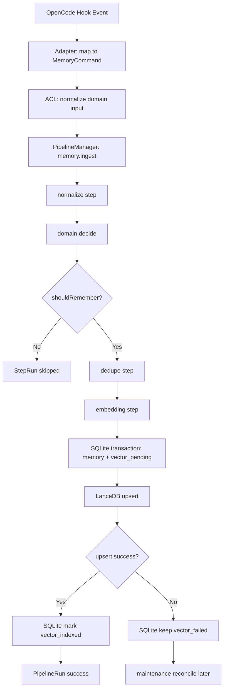
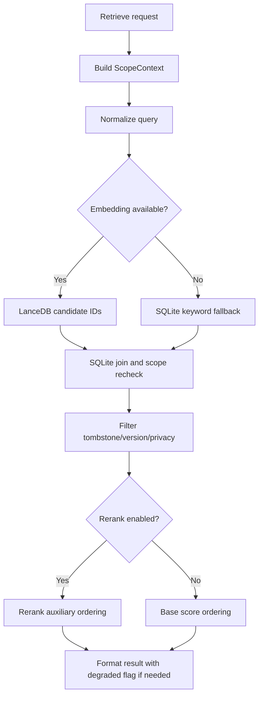
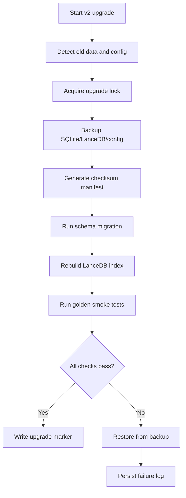
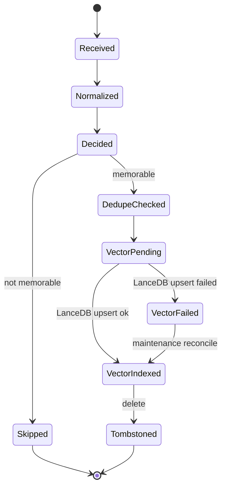
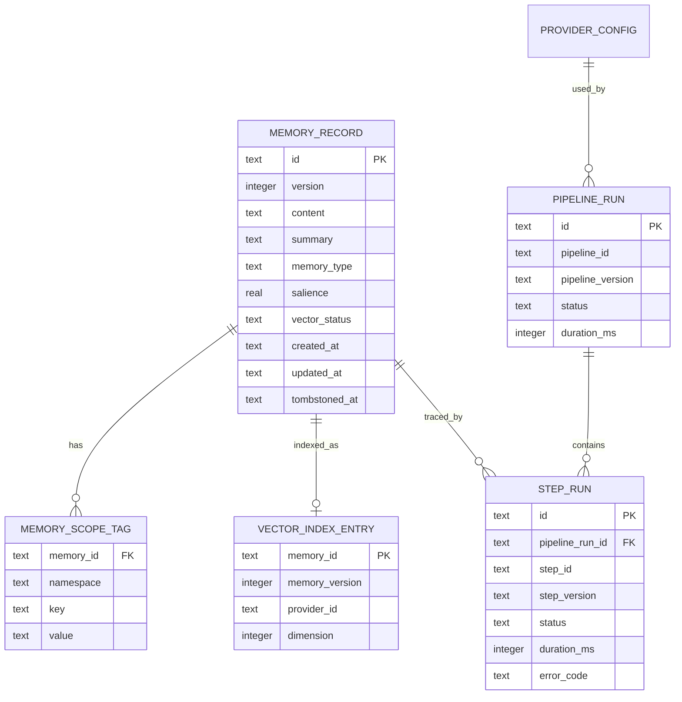

# trueMem v2.0 升级项目详细设计文档

## 1. 文档概述

| 字段 | 内容 |
|------|------|
| 文档名称 | trueMem v2.0 升级项目详细设计文档 |
| 文档版本 | v1.0 |
| 创建日期 | 2026-04-30 |
| 对应 PRD | `docs/prds/truemem-v2-upgrade-v1.0-prd.md` |
| 技术栈 | TypeScript + Bun + SQLite + LanceDB |
| 设计原则 | trueMem 认知模型不变；memU-inspired infrastructure 可替换 |

### 1.1 项目背景

trueMem 当前是面向 OpenCode 的本地记忆插件，优势在于认知心理学驱动的记忆判断：Ebbinghaus 遗忘曲线、七特征评分、四层误判防御、salience 语义与本地 viewer。当前瓶颈不在认知模型，而在工程 substrate：Hook 链路承载过多业务逻辑，SQLite 检索接近暴力搜索，embedding-worker 偏具体实现，scope 过滤逻辑容易散落在存储和查询代码中。

v2.0 目标不是把 memU 重写成 TypeScript，而是把 memU 的 Pipeline、Storage、Scope、LLM Provider 等基础设施思想转译为 trueMem 原生架构，让 trueMem 的认知模型运行在可测试、可观测、可替换的基础设施之上。

### 1.2 项目目标

1. 保留 OpenCode Hook 作为外部入口，内部升级为 PipelineManager 调度。
2. 保留 trueMem cognitive domain 的 memory decision、decay、scoring、false-positive defense、salience 语义。
3. 引入 SQLite + LanceDB 双存储：SQLite 为 source of truth，LanceDB 为可重建向量索引。
4. 引入 ScopeContext tags，并强制所有读写查删携带 scope。
5. 引入 Embedding / Chat / Rerank Provider 抽象，但默认不让 LLM 改变记忆决策。
6. 建立 golden cases 和 destructive upgrade runbook，保证行为等价与升级可恢复。

### 1.3 技术方案核心

```text
OpenCode Hook
  -> Adapter
  -> Anti-Corruption Layer
  -> PipelineManager
  -> WorkflowStep[]
  -> DomainPort / StorageProvider / ScopeContext / LlmProvider
```

核心判断：Pipeline 是执行容器，不是认知模型；LLM 是辅助信号，不是事实源；LanceDB 是派生索引，不是事实库。

---

## 2. 总体架构设计

### 2.1 分层架构

```text
src/
├── adapter/                 # OpenCode Hook 入口适配
│   ├── opencode-adapter.ts
│   └── event-mapper.ts
├── domain/                  # trueMem 认知域，不依赖基础设施实现
│   ├── cognitive-decision.ts
│   ├── seven-feature-score.ts
│   ├── ebbinghaus-decay.ts
│   ├── false-positive-defense.ts
│   ├── salience.ts
│   └── ports.ts
├── acl/                     # Anti-Corruption Layer
│   ├── memory-command-adapter.ts
│   ├── memory-record-mapper.ts
│   ├── scope-tag-translator.ts
│   └── llm-auxiliary-mapper.ts
├── pipeline/                # memU-inspired workflow substrate
│   ├── pipeline-manager.ts
│   ├── workflow-step.ts
│   ├── pipeline-context.ts
│   ├── pipeline-definition.ts
│   └── interceptors/
├── storage/                 # pluggable storage providers
│   ├── storage-provider.ts
│   ├── repositories.ts
│   ├── sqlite/
│   └── lancedb/
├── scope/
│   ├── scope-context.ts
│   ├── scope-filter.ts
│   └── reserved-tags.ts
├── llm/
│   ├── embedding-provider.ts
│   ├── chat-provider.ts
│   ├── rerank-provider.ts
│   └── provider-registry.ts
├── upgrade/
│   ├── destructive-upgrade.ts
│   ├── backup-manifest.ts
│   └── index-rebuild.ts
└── tests/
    ├── golden/
    ├── pipeline/
    ├── storage/
    ├── scope/
    └── llm/
```

### 2.2 模块职责边界

| 模块 | 职责 | 禁止事项 |
|------|------|----------|
| `adapter` | 把 OpenCode Hook event 转为内部 command | 禁止直接调用 SQLite、LanceDB、LLM SDK |
| `domain` | trueMem 认知模型与不变量 | 禁止依赖 Bun、SQLite、LanceDB、远程 SDK |
| `acl` | 外部事件、provider 结果、存储记录与领域对象互转 | 禁止做 memory decision 或改写 salience |
| `pipeline` | 编排 step、依赖检查、错误传播、观测 | 禁止持有最终认知规则 |
| `storage` | 事实存储、向量索引、reconcile | 禁止反向决定是否记忆 |
| `scope` | scope tags 标准化、过滤表达式、冲突规则 | 禁止把 scope 当作认知评分因子 |
| `llm` | embedding/chat/rerank 辅助能力 | 禁止直接写入事实状态或覆盖 domain decision |
| `upgrade` | 备份、迁移、重建、回滚说明 | 禁止半升级状态继续写入 |

### 2.3 不可破坏的认知不变量

| 不变量 | 设计约束 |
|--------|----------|
| Memory decision | `shouldRemember` 只能由 domain 层输出，Pipeline/Storage/LLM 不得覆盖 |
| Ebbinghaus decay | 时间语义、复习触发、衰减参数归 domain 所有 |
| Seven-feature scoring | 七特征含义与权重解释不得因 step 拆分而漂移 |
| False-positive defense | 四层防线必须可测试、可 trace、不可被 LLM 绕过 |
| Salience semantics | salience 不是 embedding 相似度，也不是 LLM confidence |
| Scope isolation | scope 是强隔离边界，不是 UI filter 或 best-effort metadata |
| LLM auxiliary boundary | LLM 只提供辅助信号，不是事实源、决策源、一致性源 |
| Runtime independence | TypeScript/Bun 独立运行，不依赖 memU Python/Rust runtime |

---

## 3. 核心业务流程

### 3.1 记忆写入活动图



### 3.2 记忆检索活动图



### 3.3 升级流程活动图



### 3.4 状态流转图



---

## 4. TypeScript 接口设计

### 4.1 Domain Port

```ts
export interface ScopeContext {
  workspaceId: string;
  profileId?: string;
  conversationId?: string;
  tags: readonly ScopeTag[];
}

export interface ScopeTag {
  key: string;
  value: string;
  namespace: "system" | "scope" | "source" | "user";
}

export interface MemoryInput {
  idempotencyKey: string;
  content: string;
  source: "chat" | "note" | "file" | "manual";
  scope: ScopeContext;
  createdAt: string;
  metadata?: Record<string, unknown>;
}

export interface CognitiveDecision {
  shouldRemember: boolean;
  reason: string;
  salience: number;
  memoryType: string;
  decay: EbbinghausDecayState;
  scoring: SevenFeatureScore;
  falsePositiveDefense: FalsePositiveDefenseResult;
}

export interface TrueMemDomainPort {
  decide(input: MemoryInput, aux: LlmAuxiliaryResult): Promise<CognitiveDecision>;
  score(input: MemoryInput): Promise<SevenFeatureScore>;
  applyDecay(memoryId: string, now: string): Promise<EbbinghausDecayState>;
}
```

### 4.2 Pipeline Engine

```ts
export interface PipelineContext<TInput = unknown> {
  runId: string;
  pipelineId: string;
  pipelineVersion: string;
  input: TInput;
  scope: ScopeContext;
  state: Map<string, unknown>;
  trace: PipelineTrace;
  abortSignal?: AbortSignal;
}

export interface WorkflowStep<TOutput = unknown> {
  stepId: string;
  stepVersion: string;
  requires: readonly string[];
  produces: readonly string[];
  execute(ctx: PipelineContext): Promise<TOutput>;
}

export interface PipelineDefinition {
  pipelineId: string;
  version: string;
  steps: readonly WorkflowStep[];
  enabledByDefault: boolean;
}

export interface PipelineManager {
  register(pipeline: PipelineDefinition): void;
  run<T>(pipelineId: string, ctx: PipelineContext): Promise<PipelineResult<T>>;
}

export interface PipelineInterceptor {
  beforeStep?(ctx: PipelineContext, step: WorkflowStep): Promise<void>;
  afterStep?(ctx: PipelineContext, step: WorkflowStep, result: unknown): Promise<void>;
  onError?(ctx: PipelineContext, step: WorkflowStep, error: PipelineError): Promise<"retry" | "skip" | "abort">;
}
```

### 4.3 Storage Provider

```ts
export type VectorStatus = "none" | "vector_pending" | "vector_indexed" | "vector_failed" | "vector_stale";

export interface MemoryRecord {
  id: string;
  version: number;
  content: string;
  summary?: string;
  memoryType: string;
  salience: number;
  scope: ScopeContext;
  vectorStatus: VectorStatus;
  tombstonedAt?: string;
  createdAt: string;
  updatedAt: string;
  metadata: Record<string, unknown>;
}

export interface StorageProvider {
  writeMemory(record: MemoryRecord): Promise<StorageWriteResult>;
  getMemory(id: string, scope: ScopeContext): Promise<MemoryRecord | null>;
  search(query: VectorSearchQuery, scope: ScopeContext): Promise<MemorySearchResult[]>;
  tombstone(id: string, scope: ScopeContext): Promise<void>;
  reconcileVectorIndex(): Promise<ReconcileReport>;
}

export interface VectorSearchQuery {
  embedding: readonly number[];
  limit: number;
  scope: ScopeContext;
  minScore?: number;
}
```

### 4.4 LLM Provider

```ts
export interface EmbeddingProvider {
  providerId: string;
  model: string;
  dimension: number;
  embed(request: EmbeddingRequest): Promise<EmbeddingResult>;
}

export interface ChatProvider {
  providerId: string;
  complete(request: ChatRequest): Promise<ChatResult>;
}

export interface RerankProvider {
  providerId: string;
  rerank(request: RerankRequest): Promise<RerankResult>;
}

export interface LlmAuxiliaryResult {
  extractionHint?: unknown;
  summaryHint?: string;
  classificationHint?: string;
  embedding?: readonly number[];
  rerankScores?: readonly number[];
}
```

LLM Provider 返回值只能进入 `LlmAuxiliaryResult`，再交由 `TrueMemDomainPort` 判断；禁止 provider 直接输出最终 `shouldRemember`、`salience`、`decay`。

---

## 5. 数据设计

### 5.1 逻辑 ER 图



### 5.2 SQLite 表设计

```sql
CREATE TABLE memory_records (
  id TEXT PRIMARY KEY,
  version INTEGER NOT NULL DEFAULT 1,
  content TEXT NOT NULL,
  summary TEXT,
  memory_type TEXT NOT NULL,
  salience REAL NOT NULL,
  vector_status TEXT NOT NULL DEFAULT 'none',
  metadata_json TEXT NOT NULL DEFAULT '{}',
  created_at TEXT NOT NULL,
  updated_at TEXT NOT NULL,
  tombstoned_at TEXT
);

CREATE INDEX idx_memory_records_type ON memory_records(memory_type);
CREATE INDEX idx_memory_records_vector_status ON memory_records(vector_status);
CREATE INDEX idx_memory_records_tombstoned_at ON memory_records(tombstoned_at);

CREATE TABLE memory_scope_tags (
  memory_id TEXT NOT NULL,
  namespace TEXT NOT NULL,
  key TEXT NOT NULL,
  value TEXT NOT NULL,
  PRIMARY KEY (memory_id, namespace, key, value),
  FOREIGN KEY (memory_id) REFERENCES memory_records(id)
);

CREATE INDEX idx_scope_lookup ON memory_scope_tags(namespace, key, value);

CREATE TABLE pipeline_runs (
  id TEXT PRIMARY KEY,
  pipeline_id TEXT NOT NULL,
  pipeline_version TEXT NOT NULL,
  status TEXT NOT NULL,
  started_at TEXT NOT NULL,
  ended_at TEXT,
  duration_ms INTEGER,
  degraded INTEGER NOT NULL DEFAULT 0
);

CREATE TABLE step_runs (
  id TEXT PRIMARY KEY,
  pipeline_run_id TEXT NOT NULL,
  step_id TEXT NOT NULL,
  step_version TEXT NOT NULL,
  status TEXT NOT NULL,
  duration_ms INTEGER,
  error_code TEXT,
  input_summary TEXT,
  output_summary TEXT,
  provider_id TEXT,
  FOREIGN KEY (pipeline_run_id) REFERENCES pipeline_runs(id)
);

CREATE TABLE provider_configs (
  id TEXT PRIMARY KEY,
  provider_type TEXT NOT NULL,
  provider_id TEXT NOT NULL,
  profile_name TEXT NOT NULL,
  options_json TEXT NOT NULL,
  enabled INTEGER NOT NULL DEFAULT 1,
  created_at TEXT NOT NULL,
  updated_at TEXT NOT NULL
);
```

### 5.3 LanceDB 索引设计

| 字段 | 类型 | 说明 |
|------|------|------|
| `memory_id` | string | 对应 SQLite `memory_records.id` |
| `memory_version` | number | 对应 SQLite 版本；读取时必须复核 |
| `vector` | float[] | embedding 向量 |
| `provider_id` | string | embedding provider |
| `model` | string | embedding model |
| `dimension` | number | 向量维度 |
| `scope_keys` | string[] | 用于粗过滤的 scope 摘要；最终仍回 SQLite 复核 |
| `created_at` | string | 索引创建时间 |

### 5.4 SQLite + LanceDB 一致性协议

| 场景 | 协议 |
|------|------|
| 新增 | SQLite 事务写入 memory + scope tags，`vector_status=vector_pending`；LanceDB upsert 成功后更新为 `vector_indexed` |
| 更新 | SQLite version +1；LanceDB upsert 新 embedding；读取以 SQLite version 为准 |
| 删除 | SQLite tombstone 是事实；LanceDB 删除失败由 maintenance reconcile 修复 |
| LanceDB 失败 | 保留 SQLite 记录，标记 `vector_failed`，检索降级并返回 degraded |
| LanceDB 陈旧 | 搜索仅取 candidate ids，必须回 SQLite 校验 scope、version、tombstone、privacy |
| 重建索引 | 从 SQLite 非 tombstoned 记录全量生成 embedding 并 upsert LanceDB |

---

## 6. Pipeline 设计

### 6.1 必需 Pipeline

| Pipeline | 版本 | Steps | 说明 |
|----------|------|-------|------|
| `memory.ingest` | `v1` | normalize -> decide -> dedupe -> embed -> persist -> index | 写入主链路 |
| `memory.retrieve` | `v1` | normalizeQuery -> embedQuery -> vectorSearch -> sqliteRecheck -> rerank -> format | 检索主链路 |
| `memory.decay` | `v1` | loadCandidates -> domain.applyDecay -> persistScore | 衰减维护 |
| `memory.maintenance` | `v1` | scan -> validate -> reconcile -> rebuildIndex | 修复与重建 |

### 6.2 Step 规则

1. 每个 step 必须声明 `stepId`、`stepVersion`、`requires`、`produces`。
2. 每个 step 必须可单元测试，不依赖真实远程 provider。
3. 认知相关 step 只能调用 `TrueMemDomainPort`，不能内联复制 domain 规则。
4. Interceptor 只能记录、拦截错误、触发 retry/skip/abort，不能改写认知结果。
5. PipelineRun 必须记录 pipeline/step/provider 版本，保证历史 trace 可解释。

### 6.3 错误策略

| 错误类型 | 示例 | 策略 |
|----------|------|------|
| retryable | provider 超时、LanceDB 短暂锁定 | 指数退避重试，超限进入 failed jobs |
| non-retryable | schema 不兼容、embedding dimension 不匹配 | 立即失败，提示修复配置或重建索引 |
| degradable | Rerank 不可用、LanceDB 不可用但 SQLite 可用 | 降级执行，结果标记 degraded |
| fatal | SQLite 损坏、半升级不可恢复 | 中止写入，保留诊断，要求恢复备份 |

### 6.4 队列与背压

| 项目 | 设计 |
|------|------|
| 优先级 | retrieve > ingest > maintenance |
| 上限 | 必须配置最大 pending jobs，防止 Hook 异步任务无限堆积 |
| 失败记录 | 超过重试上限进入 failed jobs，由 maintenance 处理 |
| 丢弃策略 | 低价值 maintenance 可丢弃；用户显式记忆请求不得静默丢弃 |

---

## 7. Scope Model 设计

### 7.1 ScopeContext 规则

| 规则 | 要求 |
|------|------|
| 强制携带 | memory read/write/search/delete 全部要求 `ScopeContext` |
| Reserved tags | `system:*`、`scope:*`、`source:*` 为保留 namespace，用户不可覆盖 |
| key 规范 | 小写，kebab-case 或 snake_case，禁止空 key |
| 冲突优先级 | conversation > workspace/project > profile > global |
| 缺省值 | `source=opencode`，`visibility=local` |
| 双层过滤 | LanceDB metadata 粗过滤 + SQLite scope 强复核 |

### 7.2 默认保留标签

| Tag | 示例 | 含义 |
|-----|------|------|
| `scope:workspace` | `memU-main` | 工作区边界 |
| `scope:conversation` | `ses_xxx` | 会话边界 |
| `source:app` | `opencode` | 来源系统 |
| `system:type` | `preference` | 记忆类型 |
| `system:confidence` | `high` | 置信等级 |
| `system:visibility` | `local` | 可见范围 |

---

## 8. LLM Provider 设计

### 8.1 Provider 能力矩阵

| Provider 类型 | 用途 | 默认阶段 | 边界 |
|---------------|------|----------|------|
| EmbeddingProvider | 文本向量化、检索 query 向量化 | M4 可接入，M2 可 mock | 不决定 memory decision |
| ChatProvider | 摘要、解释、结构化提取 | M4 | 只输出辅助 hint |
| RerankProvider | 检索候选重排 | M4 | 不改变 scope 过滤，不覆盖 salience |

### 8.2 Local-only 隐私约束

1. 默认不启用远程同步、云端索引、多用户 SaaS。
2. 远程 provider 必须显式配置，并标记 data egress。
3. local-only mode 下，memory 原文、摘要、embedding 请求不得离开本机。
4. trace、error、failed jobs 默认只记录摘要，不记录敏感原文和 token。
5. provider config 中 token、endpoint、secret 不得写入普通 trace。

---

## 9. Anti-Corruption Layer 设计

### 9.1 ACL 组件

| 组件 | 输入 | 输出 | 职责 |
|------|------|------|------|
| `MemoryCommandAdapter` | OpenCode event | `MemoryInput` | 事件标准化、idempotency key、source 标记 |
| `MemoryRecordMapper` | Domain decision + storage record | `MemoryRecord` | 领域对象与持久化对象互转 |
| `ScopeTagTranslator` | legacy scope / hook metadata | `ScopeContext` | scope tags 标准化与冲突处理 |
| `LlmAuxiliaryMapper` | provider output | `LlmAuxiliaryResult` | 把 LLM 输出降级为辅助信号 |

### 9.2 ACL 禁止事项

1. 不做 `shouldRemember` 判断。
2. 不重算 salience。
3. 不重写 decay。
4. 不跳过四层 false-positive defense。
5. 不引入 memU Python/Rust runtime、类型结构或目录结构。

---

## 10. 破坏性升级 Runbook

### 10.1 升级步骤

1. 检查当前 trueMem 版本、数据目录、SQLite schema、LanceDB index、配置文件。
2. 停止 Hook 写入入口，进入 upgrade lock。
3. 生成本地备份：SQLite dump、LanceDB 目录副本、配置快照。
4. 生成 checksum manifest，记录备份文件、大小、hash、时间。
5. 执行 schema migration 或 destructive reset。
6. 根据 SQLite 事实记录重建 LanceDB 索引。
7. 执行 golden smoke tests 与 scope isolation smoke tests。
8. 成功后写入 upgrade marker。
9. 失败时从备份恢复，保留失败日志，禁止半升级状态继续写入。

### 10.2 用户提示

| 场景 | 提示要求 |
|------|----------|
| destructive reset | 明确说明旧数据可能丢失，不保证无损迁移 |
| index rebuild | 明确说明耗时与可中断影响 |
| remote provider | 明确说明数据可能外发 |
| restore backup | 明确说明需要停止 OpenCode/trueMem 后替换文件 |

---

## 11. 测试设计

### 11.1 Golden Cases

| 类别 | 必测内容 |
|------|----------|
| 应记忆 | 用户偏好、明确决策、长期事实、项目约束 |
| 不应记忆 | 临时闲聊、一次性命令、短期噪音、敏感凭证 |
| False-positive defense | 四层防线每层命中与未命中 |
| Seven-feature scoring | 固定输入的 score 区间稳定 |
| Ebbinghaus decay | 固定时间点的 decay/salience 结果稳定 |
| 检索排序 | 固定 query + memory set 的 Top-K 或排序区间 |
| Scope isolation | workspace/profile/conversation/tags 互不泄漏 |
| LLM boundary | LLM 幻觉、空结果、错误分类不改变 hard invariants |

### 11.2 工程测试矩阵

| 模块 | 测试重点 |
|------|----------|
| Pipeline | step 顺序、requires/produces、retry/skip/abort、trace 版本 |
| Storage | SQLite 成功 LanceDB 失败、LanceDB 陈旧、tombstone 后向量召回 |
| Scope | SQLite where + LanceDB metadata filter + SQLite recheck |
| LLM | mock provider、本地 provider、远程 provider 显式开启、local-only 禁止远程 |
| Upgrade | 备份、失败回滚、重复执行、checksum、index rebuild |
| Queue | 超时、积压、失败重试、failed jobs、maintenance 丢弃策略 |

---

## 12. 非功能设计

### 12.1 性能

| 指标 | 设计 |
|------|------|
| Hook 主链路 | 重计算、embedding、reindex 异步化 |
| 检索 | LanceDB 提供候选召回，SQLite 做最终复核 |
| 写入 | SQLite 快速落事实，LanceDB 失败可后台 reconcile |
| 观测 | trace 记录摘要，不记录大块原文 |

### 12.2 可靠性

1. SQLite 是事实源，任何检索结果必须回 SQLite 校验。
2. LanceDB 可删除、可重建、可校验。
3. fatal 错误下禁止继续写入。
4. upgrade lock 防止半升级写入。
5. failed jobs 不得静默吞掉。

### 12.3 可扩展性

1. 新 StorageProvider 不修改 domain。
2. 新 LLM Provider 不修改 WorkflowStep。
3. 新 scope tag 不修改核心表结构。
4. 新 Pipeline 必须声明版本、开关、golden case 影响。

---

## 13. 里程碑与门禁

| 阶段 | 目标 | 交付物 | 通过标准 |
|------|------|--------|----------|
| M1 | Pipeline Engine | PipelineManager、WorkflowStep、Interceptor、基础 ingest pipeline | golden cognitive cases 全绿；结果不变，只改变执行结构 |
| M2 | Pluggable Storage | SQLite source-of-truth、LanceDB derived index、reconcile、tombstone、backup | 双写、降级、重建、rollback 测试通过 |
| M3 | Scope Model | ScopeContext、reserved tags、双层过滤、冲突规则 | 所有 API 强制 scope；跨 scope 泄漏测试为零 |
| M4 | LLM Provider | Embedding/Chat/Rerank provider、mock、本地/远程配置、local-only | provider 可替换；LLM 不绕过 domain decision；故障可降级或明确失败 |

---

## 14. 风险与应对

| 风险 | 等级 | 应对 |
|------|------|------|
| 基础设施反客为主，变成 memU TypeScript 复刻 | 高 | domain/ACL 边界 + non-negotiable invariants |
| LLM confidence 污染 salience | 高 | LLM 只进入 `LlmAuxiliaryResult`，最终由 domain 判断 |
| LanceDB 被误用为事实库 | 高 | SQLite source-of-truth；搜索结果必须 SQLite recheck |
| Scope tags 语义膨胀 | 中 | reserved namespace + 冲突优先级 + 双层过滤 |
| 破坏性升级后无法恢复 | 高 | backup manifest + upgrade lock + restore path |
| Pipeline trace 不可解释 | 中 | 记录 pipeline/step/provider version |
| Hook 队列堆积 | 中 | 队列上限、优先级、failed jobs、maintenance 丢弃策略 |

---

## 15. 验收清单

- [ ] `domain/` 不依赖 SQLite、LanceDB、Bun runtime、远程 SDK。
- [ ] `PipelineManager` 可执行 `memory.ingest`、`memory.retrieve`、`memory.decay`、`memory.maintenance`。
- [ ] 所有 cognitive decision 通过 `TrueMemDomainPort` 完成。
- [ ] SQLite 写事实记录，LanceDB 只保存派生向量索引。
- [ ] LanceDB 不可用时检索降级并标记 degraded。
- [ ] 所有 read/write/search/delete 强制携带 `ScopeContext`。
- [ ] 搜索结果经过 SQLite scope/tombstone/version/privacy 复核。
- [ ] LLM Provider 可 mock；local-only mode 禁止远程调用。
- [ ] destructive upgrade 有 backup、checksum、restore、upgrade marker。
- [ ] Golden cases 覆盖认知不变量、scope isolation、storage consistency、LLM boundary。
