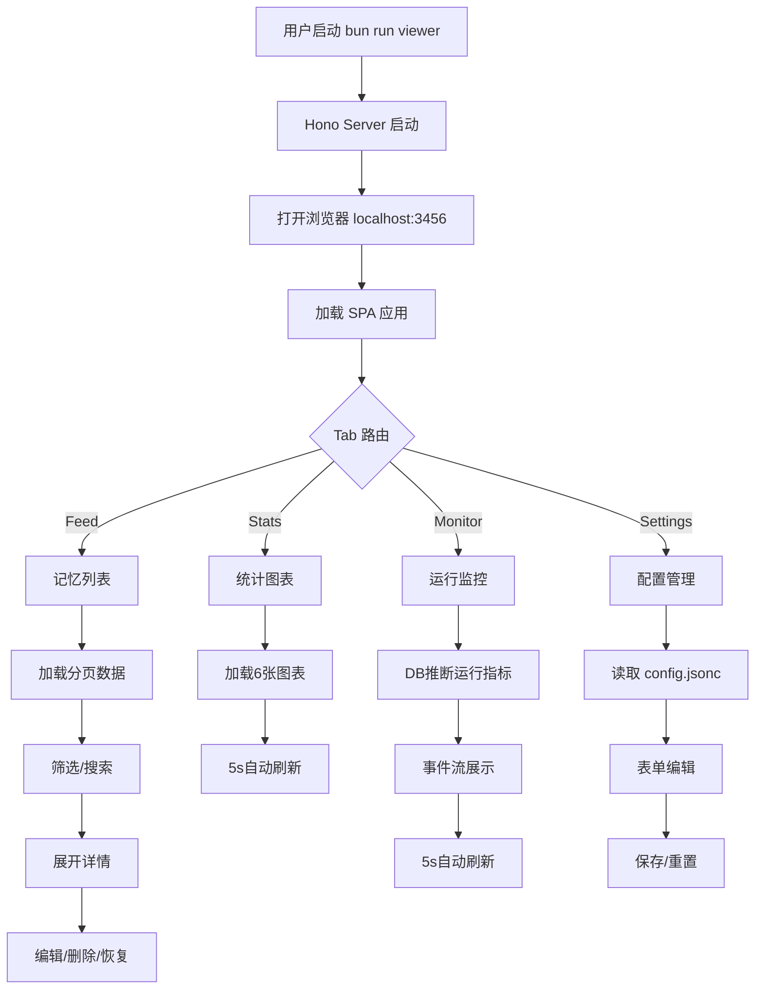
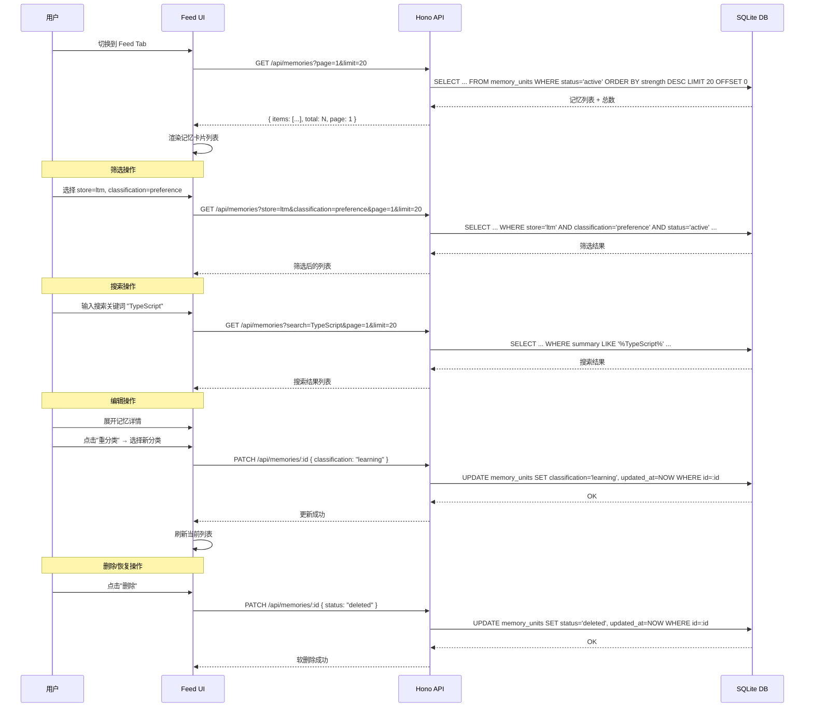
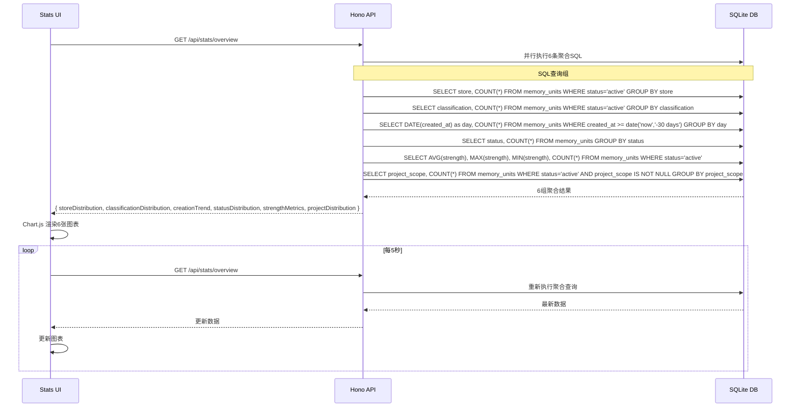
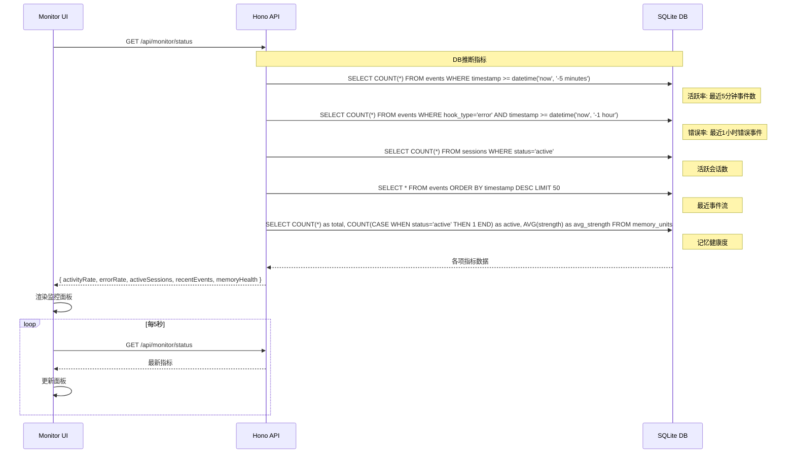
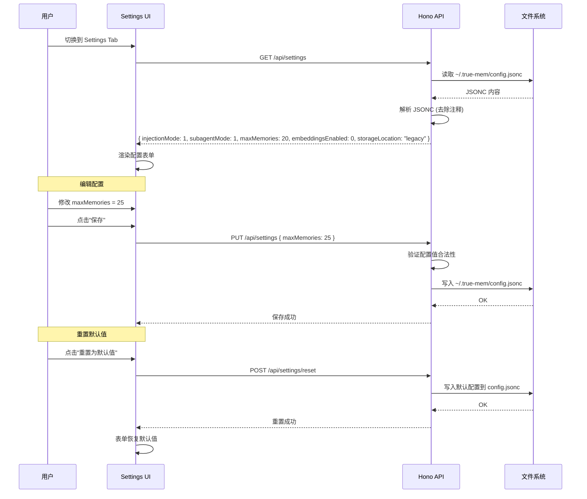
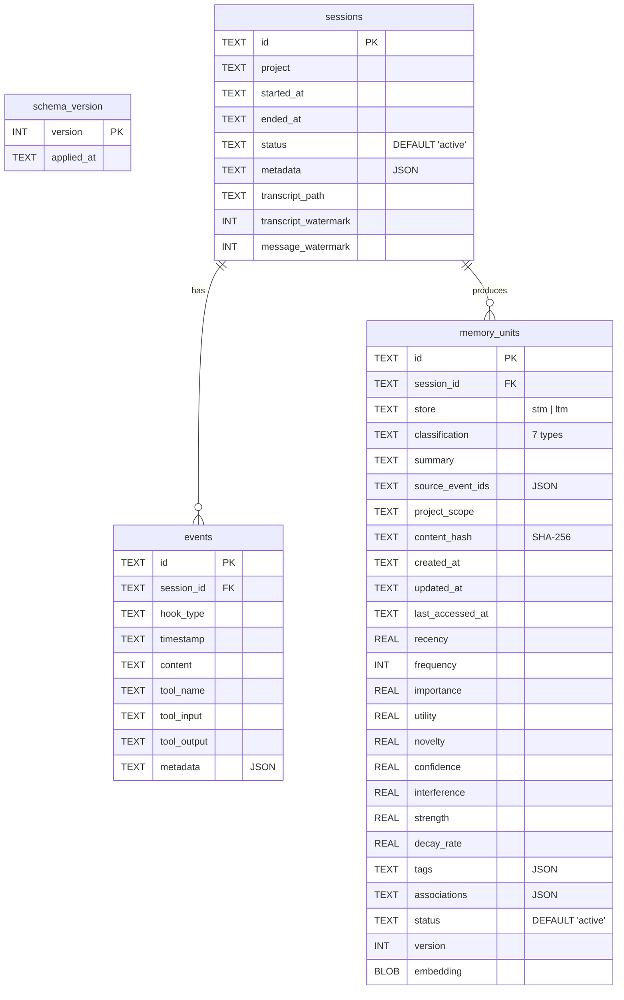
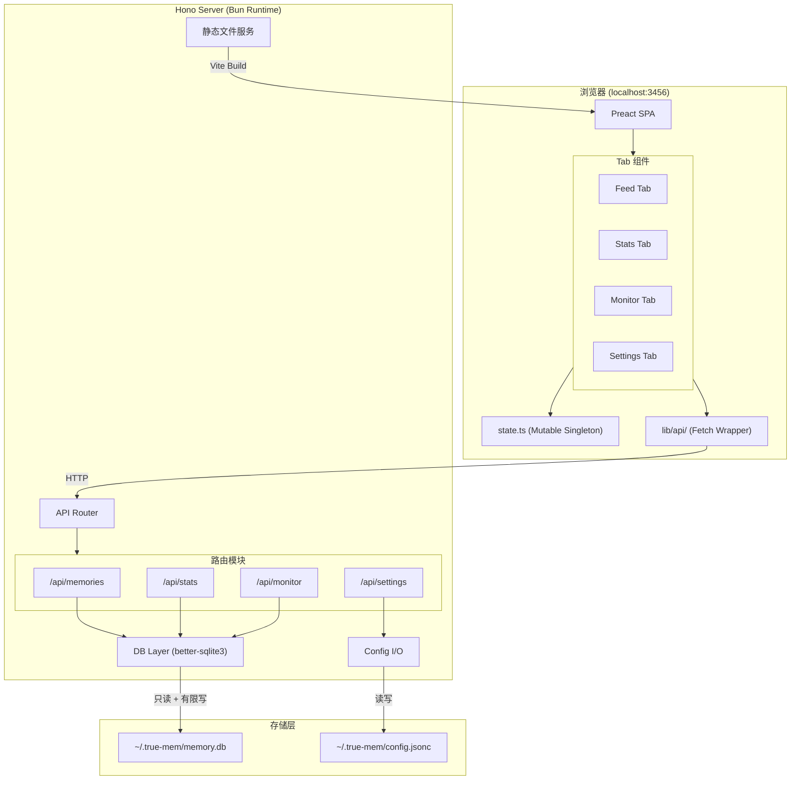
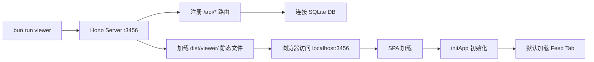

# 详细设计文档 — trueMem Viewer V1.0

| 项目 | 值 |
|------|-----|
| 产品名称 | trueMem Viewer V1.0 |
| 文档版本 | 1.0 |
| 创建日期 | 2025-04-30 |
| 关联PRD | `docs/prds/truemem-viewer-v1.0.md` |
| 技术栈 | Preact + Tailwind CSS + Hono + better-sqlite3 + Vite + Bun |

---

## 第一章 背景与目标

### 1.1 项目背景

trueMem 是 OpenCode 的持久化记忆插件，基于 Bun/TypeScript/SQLite 构建。当前版本(v1.4.1)已具备完整的记忆提取、分类、注入能力，但缺乏可视化界面——开发者只能通过 SQLite CLI 或日志文件查看记忆状态。

trueMem Viewer 旨在提供一个轻量级 Web 界面，让开发者能够直观地浏览、管理记忆条目，并监控插件运行状态。

### 1.2 设计目标

| 目标 | 描述 | 验收标准 |
|------|------|----------|
| 记忆浏览与管理 | 查看、筛选、搜索、编辑、删除记忆条目 | Feed Tab 支持分页、5维筛选、LIKE搜索、软删除/恢复/重分类 |
| 统计可视化 | 6种图表展示记忆分布与趋势 | Stats Tab 6张图表正确渲染，5s自动刷新 |
| 运行监控 | 通过DB推断展示插件运行状态 | Monitor Tab 显示活跃率、错误率、会话数、事件流 |
| 配置管理 | 可视化编辑 trueMem 配置 | Settings Tab 读写 config.jsonc，支持重置默认值 |

### 1.3 设计约束

- **单用户**: 开发者本地自用，无需认证/鉴权
- **只读优先**: 数据库以只读方式打开，仅 status/classification 更新和 config 写入例外
- **Windows平台**: 主要运行环境为 Windows
- **暗色主题**: 深色背景 + 薄荷绿(mint green)强调色
- **轮询模式**: 5s 间隔轮询数据库，V1 不使用 WebSocket

### 1.4 排除范围

- 数据导出功能
- 移动端适配
- 多用户/权限系统
- 运行时API直连(V2规划)

---

## 第二章 业务流程设计

### 2.1 整体业务流程



### 2.2 Feed Tab 业务流程 (F01-F04)



### 2.3 Stats Tab 业务流程 (F05)



### 2.4 Monitor Tab 业务流程 (F06)



### 2.5 Settings Tab 业务流程 (F07)



---

## 第三章 数据设计

### 3.1 数据库概述

trueMem Viewer **不创建新表**，直接读取 trueMem 插件已有的 SQLite 数据库 (`~/.true-mem/memory.db`)。写操作仅限于:
- `memory_units.status` 更新 (软删除/恢复)
- `memory_units.classification` 更新 (重分类)
- `memory_units.updated_at` 更新 (伴随上述操作)

### 3.2 ER 图



### 3.3 表结构详细说明

#### 3.3.1 memory_units (核心表)

| 字段 | 类型 | 约束 | 说明 | Viewer用途 |
|------|------|------|------|-----------|
| id | TEXT | PK | UUID | 唯一标识，API路由参数 |
| session_id | TEXT | FK → sessions.id | 来源会话 | 关联查询 |
| store | TEXT | - | stm / ltm | 筛选维度 |
| classification | TEXT | - | 7种分类 | 筛选维度 + 可编辑 |
| summary | TEXT | - | 记忆摘要 | 列表展示 + LIKE搜索 |
| source_event_ids | TEXT | JSON | 来源事件ID列表 | 详情展示 |
| project_scope | TEXT | - | 项目路径 | 筛选维度 + 统计 |
| content_hash | TEXT | - | SHA-256 | 去重标识 |
| created_at | TEXT | - | ISO 8601 | 排序 + 趋势图 |
| updated_at | TEXT | - | ISO 8601 | 编辑时更新 |
| last_accessed_at | TEXT | - | ISO 8601 | 监控指标 |
| strength | REAL | - | 0.0-1.0 | 排序 + 筛选 + 统计 |
| status | TEXT | DEFAULT 'active' | active/decayed/deleted | 筛选 + 软删除 |
| version | INT | - | 版本号 | 详情展示 |
| tags | TEXT | JSON | 标签数组 | 详情展示 |
| associations | TEXT | JSON | 关联数组 | 详情展示 |
| recency/frequency/importance/utility/novelty/confidence/interference/decay_rate | REAL/INT | - | 记忆指标 | 详情展示 + 监控 |
| embedding | BLOB | - | 向量嵌入 | 不展示(二进制) |

**分类枚举值:**

| classification | 中文 | decay | scope |
|---------------|------|-------|-------|
| constraint | 约束 | 永不 | Global |
| preference | 偏好 | 永不 | Global |
| learning | 学习 | 永不 | Global |
| procedural | 流程 | 永不 | Global |
| decision | 决策 | 永不 | Project |
| semantic | 语义 | 永不 | Project |
| episodic | 情景 | 7天 | Project |

#### 3.3.2 sessions

| 字段 | 类型 | 约束 | Viewer用途 |
|------|------|------|-----------|
| id | TEXT | PK | 会话标识 |
| project | TEXT | - | 项目筛选 |
| started_at | TEXT | - | 监控: 会话时间线 |
| ended_at | TEXT | - | 监控: 会话持续时间 |
| status | TEXT | DEFAULT 'active' | 监控: 活跃会话数 |
| metadata | TEXT | JSON | 详情展示 |

#### 3.3.3 events

| 字段 | 类型 | 约束 | Viewer用途 |
|------|------|------|-----------|
| id | TEXT | PK | 事件标识 |
| session_id | TEXT | FK | 关联会话 |
| hook_type | TEXT | - | 监控: 事件类型分布 |
| timestamp | TEXT | - | 监控: 事件流排序 |
| content | TEXT | - | 事件详情 |
| tool_name | TEXT | - | 监控: 工具调用统计 |

### 3.4 索引设计

已有索引(由 trueMem 插件创建):

| 索引名 | 表 | 字段 | Viewer查询场景 |
|--------|-----|------|---------------|
| idx_events_session | events | session_id | 按会话查事件 |
| idx_events_timestamp | events | timestamp | 事件流时间排序 |
| idx_memory_store | memory_units | store | store筛选 |
| idx_memory_classification | memory_units | classification | classification筛选 |
| idx_memory_status | memory_units | status | status筛选 |
| idx_memory_project | memory_units | project_scope | project筛选 |
| idx_memory_strength | memory_units | strength | strength排序 |
| idx_memory_created | memory_units | created_at | 趋势图时间查询 |
| idx_memory_hash | memory_units | content_hash | 去重(插件内部) |
| idx_memory_session | memory_units | session_id | 按会话查记忆 |

**Viewer 不需要额外创建索引**，现有索引已覆盖所有查询场景。

### 3.5 配置文件结构

**文件**: `~/.true-mem/config.jsonc` (JSONC格式，支持注释)

```jsonc
{
  // 注入模式: 0=SESSION_START, 1=ALWAYS
  "injectionMode": 1,
  // 子代理模式: 0=DISABLED, 1=ENABLED
  "subagentMode": 1,
  // 最大注入记忆数
  "maxMemories": 20,
  // 嵌入向量: 0=Jaccard only, 1=Hybrid
  "embeddingsEnabled": 0,
  // 存储位置: "legacy" | "opencode"
  "storageLocation": "legacy"
}
```

**类型定义** (来自 `src/types/config.ts`):

```typescript
export interface TrueMemUserConfig {
  injectionMode: InjectionMode;    // 0 | 1
  subagentMode: SubAgentMode;      // 0 | 1
  maxMemories: number;             // 正整数
  embeddingsEnabled: number;       // 0 | 1
  storageLocation: StorageLocation; // 'legacy' | 'opencode'
}
```

**默认值**: injectionMode=1, subagentMode=1, maxMemories=20, embeddingsEnabled=0, storageLocation='legacy'

### 3.6 关键SQL查询

#### 记忆列表查询 (Feed Tab)

```sql
-- 基础分页查询
SELECT id, store, classification, summary, project_scope, strength, 
       status, created_at, updated_at
FROM memory_units 
WHERE status = :status
  AND (:store IS NULL OR store = :store)
  AND (:classification IS NULL OR classification = :classification)
  AND (:project IS NULL OR project_scope = :project)
  AND (:minStrength IS NULL OR strength >= :minStrength)
  AND (:search IS NULL OR summary LIKE '%' || :search || '%')
ORDER BY strength DESC
LIMIT :limit OFFSET :offset;

-- 总数查询 (同条件)
SELECT COUNT(*) as total FROM memory_units WHERE ...同上条件...;
```

#### 统计聚合查询 (Stats Tab)

```sql
-- Store分布
SELECT store, COUNT(*) as count FROM memory_units WHERE status='active' GROUP BY store;

-- Classification分布
SELECT classification, COUNT(*) as count FROM memory_units WHERE status='active' GROUP BY classification;

-- 30天创建趋势
SELECT DATE(created_at) as day, COUNT(*) as count 
FROM memory_units 
WHERE created_at >= date('now', '-30 days')
GROUP BY DATE(created_at) 
ORDER BY day;

-- Status分布
SELECT status, COUNT(*) as count FROM memory_units GROUP BY status;

-- Strength指标
SELECT COUNT(*) as total, AVG(strength) as avg, MAX(strength) as max, MIN(strength) as min
FROM memory_units WHERE status='active';

-- Project分布
SELECT project_scope, COUNT(*) as count 
FROM memory_units 
WHERE status='active' AND project_scope IS NOT NULL 
GROUP BY project_scope 
ORDER BY count DESC;
```

#### 监控查询 (Monitor Tab)

```sql
-- 活跃率 (最近5分钟事件数)
SELECT COUNT(*) as count FROM events WHERE timestamp >= datetime('now', '-5 minutes');

-- 错误率 (最近1小时)
SELECT COUNT(*) as count FROM events WHERE hook_type = 'error' AND timestamp >= datetime('now', '-1 hour');

-- 活跃会话
SELECT COUNT(*) as count FROM sessions WHERE status = 'active';

-- 最近事件流
SELECT id, session_id, hook_type, timestamp, tool_name 
FROM events ORDER BY timestamp DESC LIMIT 50;

-- 记忆健康度
SELECT COUNT(*) as total,
       COUNT(CASE WHEN status='active' THEN 1 END) as active,
       COUNT(CASE WHEN status='decayed' THEN 1 END) as decayed,
       AVG(strength) as avg_strength
FROM memory_units;
```

---

## 第四章 系统设计

### 4.1 系统架构总览



### 4.2 目录结构

```
src/viewer/
  vite.config.ts              # Vite 构建配置
  server/
    index.ts                  # Hono 入口 + 静态文件服务
    routes/
      memories.ts             # /api/memories CRUD
      stats.ts                # /api/stats 聚合查询
      monitor.ts              # /api/monitor 运行指标
      settings.ts             # /api/settings 配置读写
    db.ts                     # better-sqlite3 连接管理
    config-io.ts              # config.jsonc 读写
  ui/
    index.html                # SPA 入口
    index.tsx                 # Preact 挂载点
    app.ts                    # Orchestrator (Tab路由 + 初始化)
    state.ts                  # 全局状态 (Mutable Singleton)
    components/
      layout.tsx              # 主布局 (Header + Tab Bar + Content)
      tabs/
        feed.tsx              # Feed Tab 组件
        stats.tsx             # Stats Tab 组件
        monitor.tsx           # Monitor Tab 组件
        settings.tsx          # Settings Tab 组件
      shared/
        pagination.tsx        # 分页组件
        filter-bar.tsx        # 筛选栏组件
        memory-card.tsx       # 记忆卡片组件
        chart-wrapper.tsx     # Chart.js 包装组件
        status-badge.tsx      # 状态徽章
        metric-card.tsx       # 指标卡片
        event-stream.tsx      # 事件流组件
    lib/
      api/
        memories.ts           # 记忆 API 调用
        stats.ts              # 统计 API 调用
        monitor.ts            # 监控 API 调用
        settings.ts           # 配置 API 调用
      polling.ts              # 5s 轮询管理器
      format.ts               # 日期/数值格式化
    styles/
      index.css               # Tailwind 入口 + 自定义样式
```

### 4.3 模块设计

#### 4.3.1 Server 层

**入口 (`server/index.ts`)**

```typescript
import { Hono } from 'hono';
import { serveStatic } from 'hono/bun';
import { memoriesRoutes } from './routes/memories';
import { statsRoutes } from './routes/stats';
import { monitorRoutes } from './routes/monitor';
import { settingsRoutes } from './routes/settings';

const app = new Hono();

// API 路由
app.route('/api/memories', memoriesRoutes);
app.route('/api/stats', statsRoutes);
app.route('/api/monitor', monitorRoutes);
app.route('/api/settings', settingsRoutes);

// 静态文件 (Vite build output)
app.use('/*', serveStatic({ root: './dist/viewer' }));

// SPA fallback
app.get('*', serveStatic({ path: './dist/viewer/index.html' }));

export default {
  port: 3456,
  fetch: app.fetch,
};
```

**数据库连接 (`server/db.ts`)**

```typescript
import Database from 'better-sqlite3';
import { homedir } from 'os';
import { join } from 'path';

let db: Database.Database | null = null;

export function getDB(): Database.Database {
  if (!db) {
    const dbPath = join(homedir(), '.true-mem', 'memory.db');
    db = new Database(dbPath, { readonly: false }); // 需要有限写入
    db.pragma('journal_mode = WAL');
    db.pragma('busy_timeout = 5000');
  }
  return db;
}

export function closeDB(): void {
  if (db) {
    db.close();
    db = null;
  }
}
```

**配置读写 (`server/config-io.ts`)**

```typescript
import { readFileSync, writeFileSync } from 'fs';
import { homedir } from 'os';
import { join } from 'path';

const CONFIG_PATH = join(homedir(), '.true-mem', 'config.jsonc');

// JSONC 解析: 去除注释
function stripJsonComments(text: string): string {
  return text.replace(/\/\/.*$/gm, '').replace(/\/\*[\s\S]*?\*\//g, '');
}

export function readConfig(): Record<string, unknown> {
  const raw = readFileSync(CONFIG_PATH, 'utf-8');
  return JSON.parse(stripJsonComments(raw));
}

export function writeConfig(config: Record<string, unknown>): void {
  // 写入时保留可读格式，但不保留原始注释
  writeFileSync(CONFIG_PATH, JSON.stringify(config, null, 2), 'utf-8');
}
```

#### 4.3.2 API 路由设计

| 方法 | 路径 | 说明 | 请求参数 | 响应 |
|------|------|------|----------|------|
| GET | /api/memories | 分页查询记忆 | page, limit, store, classification, status, project, minStrength, maxStrength, search | `{ items: Memory[], total: number, page: number, limit: number }` |
| GET | /api/memories/:id | 获取单条记忆详情 | - | `Memory` (含全部字段) |
| PATCH | /api/memories/:id | 更新记忆 | `{ status?, classification? }` | `{ success: true }` |
| GET | /api/stats/overview | 获取统计概览 | - | `StatsOverview` |
| GET | /api/monitor/status | 获取监控指标 | - | `MonitorStatus` |
| GET | /api/settings | 获取配置 | - | `TrueMemUserConfig` |
| PUT | /api/settings | 更新配置 | `TrueMemUserConfig` (部分) | `{ success: true }` |
| POST | /api/settings/reset | 重置为默认配置 | - | `TrueMemUserConfig` (默认值) |

**路由实现示例 (`server/routes/memories.ts`)**

```typescript
import { Hono } from 'hono';
import { getDB } from '../db';

export const memoriesRoutes = new Hono();

memoriesRoutes.get('/', (c) => {
  const db = getDB();
  const page = Number(c.req.query('page') || '1');
  const limit = Math.min(Number(c.req.query('limit') || '20'), 100);
  const offset = (page - 1) * limit;
  
  const store = c.req.query('store') || null;
  const classification = c.req.query('classification') || null;
  const status = c.req.query('status') || 'active';
  const project = c.req.query('project') || null;
  const search = c.req.query('search') || null;
  const minStrength = c.req.query('minStrength') ? Number(c.req.query('minStrength')) : null;
  const maxStrength = c.req.query('maxStrength') ? Number(c.req.query('maxStrength')) : null;

  // 动态构建 WHERE 子句
  const conditions: string[] = ['status = ?'];
  const params: unknown[] = [status];

  if (store) { conditions.push('store = ?'); params.push(store); }
  if (classification) { conditions.push('classification = ?'); params.push(classification); }
  if (project) { conditions.push('project_scope = ?'); params.push(project); }
  if (minStrength !== null) { conditions.push('strength >= ?'); params.push(minStrength); }
  if (maxStrength !== null) { conditions.push('strength <= ?'); params.push(maxStrength); }
  if (search) { conditions.push("summary LIKE ?"); params.push(`%${search}%`); }

  const where = conditions.join(' AND ');

  const items = db.prepare(
    `SELECT id, store, classification, summary, project_scope, strength, 
            status, created_at, updated_at, tags
     FROM memory_units WHERE ${where}
     ORDER BY strength DESC LIMIT ? OFFSET ?`
  ).all(...params, limit, offset);

  const { total } = db.prepare(
    `SELECT COUNT(*) as total FROM memory_units WHERE ${where}`
  ).get(...params) as { total: number };

  return c.json({ items, total, page, limit });
});

memoriesRoutes.get('/:id', (c) => {
  const db = getDB();
  const memory = db.prepare('SELECT * FROM memory_units WHERE id = ?').get(c.req.param('id'));
  if (!memory) return c.json({ error: 'Not found' }, 404);
  return c.json(memory);
});

memoriesRoutes.patch('/:id', async (c) => {
  const db = getDB();
  const id = c.req.param('id');
  const body = await c.req.json<{ status?: string; classification?: string }>();
  
  const updates: string[] = ['updated_at = datetime("now")'];
  const params: unknown[] = [];

  if (body.status) {
    if (!['active', 'decayed', 'deleted'].includes(body.status)) {
      return c.json({ error: 'Invalid status' }, 400);
    }
    updates.push('status = ?');
    params.push(body.status);
  }

  if (body.classification) {
    const valid = ['constraint', 'preference', 'learning', 'procedural', 'decision', 'semantic', 'episodic'];
    if (!valid.includes(body.classification)) {
      return c.json({ error: 'Invalid classification' }, 400);
    }
    updates.push('classification = ?');
    params.push(body.classification);
  }

  params.push(id);
  db.prepare(`UPDATE memory_units SET ${updates.join(', ')} WHERE id = ?`).run(...params);
  
  return c.json({ success: true });
});
```

#### 4.3.3 UI 层

**Orchestrator (`ui/app.ts`)**

遵循 codemem 的 Orchestrator 模式:

```typescript
import { initFeedTab, loadFeedData } from './components/tabs/feed';
import { initStatsTab, loadStatsData } from './components/tabs/stats';
import { initMonitorTab, loadMonitorData } from './components/tabs/monitor';
import { initSettingsTab, loadSettingsData } from './components/tabs/settings';
import { startPolling, stopPolling } from './lib/polling';

const TAB_MAP = {
  feed: { init: initFeedTab, load: loadFeedData },
  stats: { init: initStatsTab, load: loadStatsData },
  monitor: { init: initMonitorTab, load: loadMonitorData },
  settings: { init: initSettingsTab, load: loadSettingsData },
} as const;

let currentTab: keyof typeof TAB_MAP = 'feed';
let initialized = new Set<string>();

export function switchTab(tab: keyof typeof TAB_MAP): void {
  // 隐藏所有 Tab 内容
  document.querySelectorAll('[data-tab-content]').forEach(el => {
    (el as HTMLElement).hidden = true;
  });

  // 显示目标 Tab
  const target = document.querySelector(`[data-tab-content="${tab}"]`) as HTMLElement;
  if (target) target.hidden = false;

  // 首次切换时初始化
  if (!initialized.has(tab)) {
    TAB_MAP[tab].init();
    initialized.add(tab);
  }

  // 加载数据
  TAB_MAP[tab].load();

  // 更新轮询目标
  stopPolling();
  if (tab !== 'settings') {
    startPolling(() => TAB_MAP[tab].load(), 5000);
  }

  currentTab = tab;
}

// 初始化
export function initApp(): void {
  // Tab 切换事件
  document.querySelectorAll('[data-tab]').forEach(btn => {
    btn.addEventListener('click', () => {
      const tab = (btn as HTMLElement).dataset.tab as keyof typeof TAB_MAP;
      switchTab(tab);
      // 更新 Tab 按钮样式
      document.querySelectorAll('[data-tab]').forEach(b => b.classList.remove('active'));
      btn.classList.add('active');
    });
  });

  // 默认加载 Feed Tab
  switchTab('feed');
}
```

**全局状态 (`ui/state.ts`)**

Plain mutable singleton 模式 (遵循 codemem 约定):

```typescript
export interface AppState {
  // Feed
  memories: MemoryItem[];
  totalMemories: number;
  currentPage: number;
  filters: MemoryFilters;
  searchQuery: string;
  expandedMemoryId: string | null;

  // Stats
  statsData: StatsOverview | null;

  // Monitor
  monitorData: MonitorStatus | null;

  // Settings
  config: TrueMemUserConfig | null;

  // UI
  currentTab: string;
  loading: boolean;
  error: string | null;
}

export interface MemoryItem {
  id: string;
  store: string;
  classification: string;
  summary: string;
  project_scope: string | null;
  strength: number;
  status: string;
  created_at: string;
  updated_at: string;
  tags: string | null;
}

export interface MemoryFilters {
  store: string | null;
  classification: string | null;
  status: string;
  project: string | null;
  minStrength: number | null;
  maxStrength: number | null;
}

export interface StatsOverview {
  storeDistribution: { store: string; count: number }[];
  classificationDistribution: { classification: string; count: number }[];
  creationTrend: { day: string; count: number }[];
  statusDistribution: { status: string; count: number }[];
  strengthMetrics: { total: number; avg: number; max: number; min: number };
  projectDistribution: { project_scope: string; count: number }[];
}

export interface MonitorStatus {
  activityRate: number;
  errorRate: number;
  activeSessions: number;
  recentEvents: EventItem[];
  memoryHealth: { total: number; active: number; decayed: number; avgStrength: number };
}

export interface EventItem {
  id: string;
  session_id: string;
  hook_type: string;
  timestamp: string;
  tool_name: string | null;
}

export interface TrueMemUserConfig {
  injectionMode: number;
  subagentMode: number;
  maxMemories: number;
  embeddingsEnabled: number;
  storageLocation: string;
}

// 全局状态实例
export const state: AppState = {
  memories: [],
  totalMemories: 0,
  currentPage: 1,
  filters: {
    store: null,
    classification: null,
    status: 'active',
    project: null,
    minStrength: null,
    maxStrength: null,
  },
  searchQuery: '',
  expandedMemoryId: null,
  statsData: null,
  monitorData: null,
  config: null,
  currentTab: 'feed',
  loading: false,
  error: null,
};
```

**轮询管理器 (`ui/lib/polling.ts`)**

```typescript
let intervalId: ReturnType<typeof setInterval> | null = null;

export function startPolling(callback: () => void, intervalMs: number = 5000): void {
  stopPolling();
  intervalId = setInterval(callback, intervalMs);
}

export function stopPolling(): void {
  if (intervalId !== null) {
    clearInterval(intervalId);
    intervalId = null;
  }
}
```

**API 客户端示例 (`ui/lib/api/memories.ts`)**

```typescript
import type { MemoryItem, MemoryFilters } from '../../state';

const BASE = '/api/memories';

export async function fetchMemories(
  page: number,
  limit: number,
  filters: MemoryFilters,
  search: string
): Promise<{ items: MemoryItem[]; total: number; page: number; limit: number }> {
  const params = new URLSearchParams();
  params.set('page', String(page));
  params.set('limit', String(limit));
  if (filters.store) params.set('store', filters.store);
  if (filters.classification) params.set('classification', filters.classification);
  if (filters.status) params.set('status', filters.status);
  if (filters.project) params.set('project', filters.project);
  if (filters.minStrength !== null) params.set('minStrength', String(filters.minStrength));
  if (filters.maxStrength !== null) params.set('maxStrength', String(filters.maxStrength));
  if (search) params.set('search', search);

  const res = await fetch(`${BASE}?${params}`);
  if (!res.ok) throw new Error(`Failed to fetch memories: ${res.status}`);
  return res.json();
}

export async function fetchMemoryDetail(id: string): Promise<Record<string, unknown>> {
  const res = await fetch(`${BASE}/${id}`);
  if (!res.ok) throw new Error(`Failed to fetch memory: ${res.status}`);
  return res.json();
}

export async function updateMemory(
  id: string,
  updates: { status?: string; classification?: string }
): Promise<void> {
  const res = await fetch(`${BASE}/${id}`, {
    method: 'PATCH',
    headers: { 'Content-Type': 'application/json' },
    body: JSON.stringify(updates),
  });
  if (!res.ok) throw new Error(`Failed to update memory: ${res.status}`);
}
```

#### 4.3.4 组件设计

**Feed Tab 组件 (`ui/components/tabs/feed.tsx`)**

```tsx
import { h, render } from 'preact';
import { state } from '../../state';
import { fetchMemories, updateMemory } from '../../lib/api/memories';

// Tab 合约: initXxxTab + loadXxxData
export function initFeedTab(): void {
  const container = document.querySelector('[data-tab-content="feed"]');
  if (container) render(<FeedView />, container);
}

export async function loadFeedData(): Promise<void> {
  state.loading = true;
  try {
    const result = await fetchMemories(
      state.currentPage, 20, state.filters, state.searchQuery
    );
    state.memories = result.items;
    state.totalMemories = result.total;
  } catch (err) {
    state.error = (err as Error).message;
  } finally {
    state.loading = false;
  }
}

function FeedView() {
  // Preact 组件: 筛选栏 + 记忆列表 + 分页
  return (
    <div class="flex flex-col gap-4">
      <FilterBar />
      <MemoryList />
      <Pagination />
    </div>
  );
}
```

### 4.4 暗色主题设计

**配色方案:**

| 用途 | 颜色 | Tailwind |
|------|------|----------|
| 背景 (主) | #0f172a | bg-slate-900 |
| 背景 (卡片) | #1e293b | bg-slate-800 |
| 背景 (悬浮) | #334155 | bg-slate-700 |
| 文字 (主) | #f1f5f9 | text-slate-100 |
| 文字 (次) | #94a3b8 | text-slate-400 |
| 强调色 (薄荷绿) | #34d399 | text-emerald-400 |
| 强调色 (悬浮) | #6ee7b7 | text-emerald-300 |
| 边框 | #475569 | border-slate-600 |
| 错误 | #f87171 | text-red-400 |
| 警告 | #fbbf24 | text-amber-400 |
| 成功 | #34d399 | text-emerald-400 |

**Tailwind 配置:**

```javascript
// tailwind.config.js
export default {
  content: ['./src/viewer/ui/**/*.{tsx,ts,html}'],
  darkMode: 'class',
  theme: {
    extend: {
      colors: {
        accent: {
          DEFAULT: '#34d399',
          hover: '#6ee7b7',
          dim: '#059669',
        },
      },
    },
  },
};
```

### 4.5 构建与启动

**Vite 配置 (`src/viewer/vite.config.ts`)**

```typescript
import { defineConfig } from 'vite';
import preact from '@preact/preset-vite';

export default defineConfig({
  plugins: [preact()],
  root: './src/viewer/ui',
  build: {
    outDir: '../../../dist/viewer',
    emptyOutDir: true,
  },
  server: {
    proxy: {
      '/api': 'http://localhost:3456',
    },
  },
});
```

**package.json 脚本:**

```json
{
  "scripts": {
    "viewer": "bun run src/viewer/server/index.ts",
    "viewer:dev": "vite --config src/viewer/vite.config.ts",
    "viewer:build": "vite build --config src/viewer/vite.config.ts"
  }
}
```

**启动流程:**



### 4.6 错误处理

| 场景 | 处理方式 |
|------|----------|
| DB 文件不存在 | 启动时检测，提示用户确认 trueMem 已安装 |
| DB 连接失败 | 返回 503，UI 显示连接错误提示 |
| API 参数非法 | 返回 400 + 错误描述 |
| 记忆不存在 | 返回 404 |
| config.jsonc 不存在 | 创建默认配置文件 |
| config.jsonc 解析失败 | 返回 500，UI 提示配置文件格式错误 |
| 轮询失败 | 静默重试，连续3次失败后显示错误提示 |

---

## 第五章 非功能设计

### 5.1 性能设计

| 指标 | 目标 | 实现方式 |
|------|------|----------|
| 首屏加载 | < 2s | Vite 构建优化，Preact 轻量 (~3KB gzip) |
| API 响应 | < 200ms | SQLite 本地查询，已有索引覆盖 |
| 轮询开销 | 可忽略 | 5s 间隔，单次查询 < 50ms |
| 内存占用 | < 50MB | 分页加载，不缓存全量数据 |
| Bundle 大小 | < 200KB gzip | Preact + Tailwind purge + Chart.js tree-shake |

**SQLite 优化:**
- `journal_mode = WAL`: 允许并发读写
- `busy_timeout = 5000`: 避免锁等待超时
- 参数化查询: 防止 SQL 注入 + 利用 prepared statement 缓存

### 5.2 安全设计

| 风险 | 缓解措施 |
|------|----------|
| SQL 注入 | 全部使用参数化查询 (prepared statements) |
| XSS | Preact 默认转义 HTML，不使用 dangerouslySetInnerHTML |
| CSRF | 单用户本地应用，无需 CSRF token |
| 数据泄露 | 仅监听 localhost:3456，不暴露外网 |
| 配置篡改 | 写入前验证配置值合法性 |
| 路径遍历 | API 路由参数仅接受 UUID 格式 |

### 5.3 可用性设计

| 方面 | 设计 |
|------|------|
| 键盘导航 | Tab 切换支持键盘 Tab/Enter |
| 加载状态 | 全局 loading 指示器 |
| 错误提示 | Toast 通知 + 内联错误信息 |
| 空状态 | 各 Tab 提供空状态提示文案 |
| 响应式 | 最小宽度 1024px (桌面端) |

### 5.4 可维护性设计

| 方面 | 设计 |
|------|------|
| 代码组织 | 按功能模块分目录 (server/routes, ui/components/tabs, ui/lib/api) |
| 类型安全 | TypeScript strict mode，共享类型定义 |
| 约定一致 | 遵循 codemem Orchestrator + Tab 合约模式 |
| 依赖管理 | 最小依赖: Preact, Hono, Chart.js, better-sqlite3, Tailwind |

### 5.5 兼容性

| 环境 | 要求 |
|------|------|
| 运行时 | Bun >= 1.0 |
| 浏览器 | Chrome/Edge 最新版 (开发者工具常用浏览器) |
| 操作系统 | Windows (主要), macOS/Linux (兼容) |
| Node.js | 不依赖 (Bun 原生运行) |

---

## 第六章 资源估算

### 6.1 开发工作量

| 模块 | 预估工时 | 说明 |
|------|----------|------|
| Server 层 (Hono + 路由) | 1天 | 4个路由模块 + DB连接 + 配置读写 |
| Feed Tab (UI + API) | 1.5天 | 筛选、搜索、分页、展开详情、编辑操作 |
| Stats Tab (UI + Chart.js) | 1天 | 6张图表渲染 + 数据适配 |
| Monitor Tab (UI) | 0.5天 | 指标卡片 + 事件流 |
| Settings Tab (UI) | 0.5天 | 表单 + 保存/重置 |
| 基础框架 (Vite + 路由 + 状态) | 0.5天 | 项目脚手架 + Orchestrator + 轮询 |
| 暗色主题 + 样式 | 0.5天 | Tailwind 配置 + 全局样式 |
| 联调测试 | 1天 | 端到端验证 |
| **合计** | **6.5天** | |

### 6.2 依赖清单

| 依赖 | 版本 | 用途 | 类型 |
|------|------|------|------|
| preact | ^10.x | UI 框架 | dependencies |
| hono | ^4.x | HTTP 服务器 | dependencies |
| better-sqlite3 | ^11.x | SQLite 驱动 | dependencies |
| chart.js | ^4.x | 图表渲染 | dependencies |
| tailwindcss | ^3.x | CSS 框架 | devDependencies |
| vite | ^5.x | 构建工具 | devDependencies |
| @preact/preset-vite | ^2.x | Vite Preact 插件 | devDependencies |
| autoprefixer | ^10.x | CSS 后处理 | devDependencies |
| postcss | ^8.x | CSS 处理管线 | devDependencies |

---

## 第七章 人员安排

### 7.1 角色分工

| 角色 | 职责 | 人数 |
|------|------|------|
| 全栈开发 | Server + UI 全部实现 | 1 (AI辅助开发) |

### 7.2 里程碑

| 阶段 | 内容 | 时间 |
|------|------|------|
| M1 - 基础框架 | Vite + Hono + Preact 脚手架，Tab 路由，DB 连接 | Day 1 |
| M2 - Feed Tab | 记忆列表、筛选、搜索、分页、编辑操作 | Day 2-3 |
| M3 - Stats Tab | 6张统计图表 + 自动刷新 | Day 4 |
| M4 - Monitor + Settings | 监控面板 + 配置管理 | Day 5 |
| M5 - 联调与优化 | 端到端测试、样式打磨、错误处理完善 | Day 6-7 |

### 7.3 风险与缓解

| 风险 | 影响 | 缓解措施 |
|------|------|----------|
| better-sqlite3 与 Bun 兼容性 | 高 | 备选: bun:sqlite 内置驱动 |
| Chart.js bundle 过大 | 中 | Tree-shake 仅引入所需图表类型 |
| DB 锁冲突 (Viewer写 + 插件写) | 中 | WAL 模式 + busy_timeout |
| config.jsonc 注释丢失 | 低 | 写入时使用固定注释模板 |

---

## 附录

### A. 术语表

| 术语 | 说明 |
|------|------|
| STM | Short-Term Memory，短期记忆 |
| LTM | Long-Term Memory，长期记忆 |
| Strength | 记忆强度，0.0-1.0，用于排序和衰减 |
| Decay | 记忆衰减，仅 episodic 类型会衰减 (7天) |
| Injection | 记忆注入，将记忆插入 AI 模型的 system prompt |
| JSONC | JSON with Comments，支持注释的 JSON 格式 |
| WAL | Write-Ahead Logging，SQLite 并发模式 |

### B. 参考文档

- PRD: `docs/prds/truemem-viewer-v1.0.md`
- trueMem 主项目: `AGENTS.md`
- codemem UI 参考: Orchestrator + Tab 合约模式
- 数据库 Schema: `src/storage/database.ts`
- 配置类型: `src/types/config.ts`
